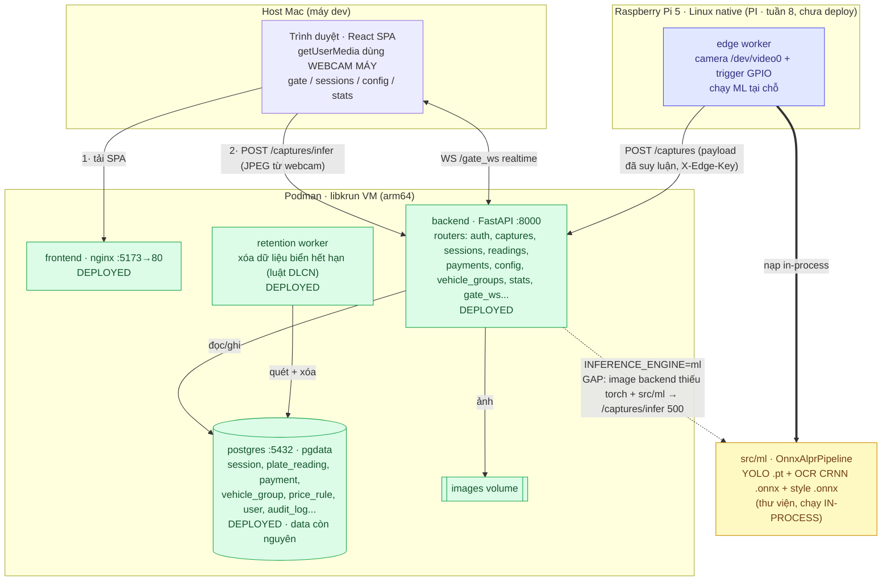

# Kiến trúc hiện tại (SmartPark), ảnh chụp 01/09/2026

Trạng thái thật, suy từ code + deploy podman đang chạy. Đánh dấu: DEPLOYED (đang chạy podman Mac), GAP (đã code nhưng chưa chạy được), PI (thuộc Raspberry Pi, chưa deploy).

## Deployment + luồng dữ liệu



## Hai đường nạp ảnh (cùng đổ về backend)

- **Đường A · Kiosk/trình duyệt (đang xây, chạy được trên Mac):** webcam do TRÌNH DUYỆT truy cập (host), chụp JPEG, `POST /captures/infer`. Backend tự chạy ML (`INFERENCE_ENGINE=ml`) rồi ra quyết định VÀO/RA. Container KHÔNG cần camera.
- **Đường B · Edge/Pi (thuộc Pi):** edge worker có camera + trigger riêng, chạy ML tại chỗ, `POST /captures` kèm payload đã suy luận (xác thực `X-Edge-Key`). Backend không suy luận lại.

Cả hai dùng chung `src/ml` (OnnxAlprPipeline) và chung schema payload. ML là thư viện nạp in-process, không phải service riêng.

## Gap chặn đường A ngay lúc này

`INFERENCE_ENGINE=ml` đã bật, nhưng image backend build từ context `./src/backend`, chỉ cài `requirements.txt`. Hệ quả:
- không có `ultralytics/onnxruntime/torch` trong image,
- không có `src/ml` (code + weights) trong image,
- `POST /captures/infer` trả **500**.

Để chạy đường A trong podman: build ml-backend image (context repo root, COPY `src/ml`, cài thêm `requirements-ml.txt`). Cùng image chạy được trên Pi single-box.
```
