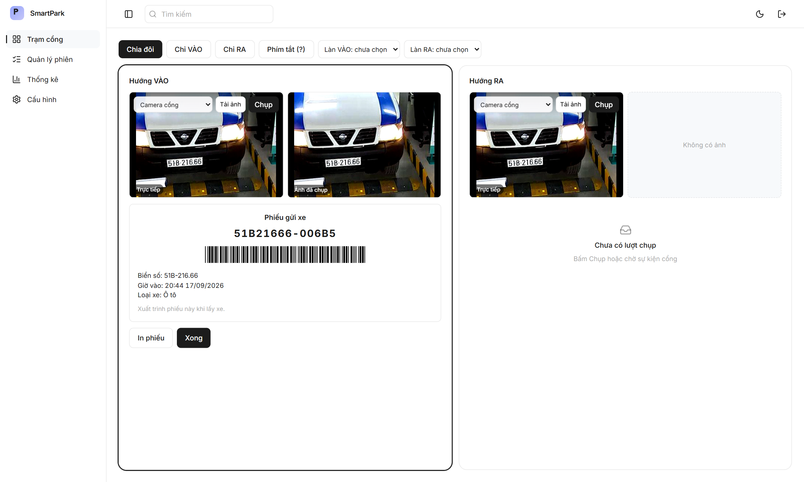
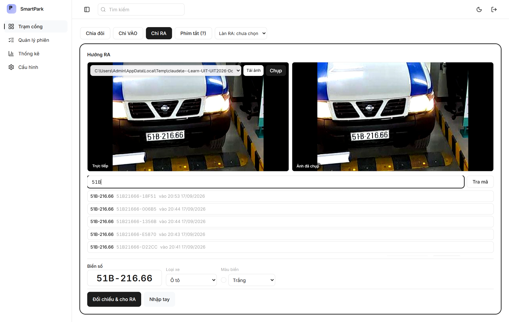
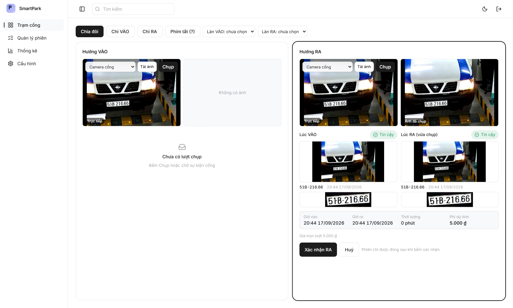

# Phiếu gửi xe kèm mã vạch

## Giải pháp

Sau khi xác nhận xe vào, màn Trạm cổng hiện phiếu gửi xe để nhân viên in đưa khách. Phiếu ghi mã phiên dạng `BIENSO-XXXXX`: phần đầu là biển số bỏ dấu phân cách, phần đuôi năm ký tự lấy từ mã định danh (uuid) của phiên. Phần biển số giúp nhân viên gõ nhanh và đoán được xe; phần đuôi lấy từ uuid nên không suy ra được chỉ từ biển số, và tách biệt với cặp cột mã hóa/băm của biển số trong cơ sở dữ liệu. Mã in kèm mã vạch Code39; bản in chỉ gồm phần phiếu, khổ giấy đặt theo cỡ 80 mm của máy in nhiệt ở quầy.

Khi xe ra, nhân viên quét mã vạch trên phiếu hoặc gõ vào ô tra cứu ở khung RA; đầu đọc mã vạch cắm cổng USB hoạt động như bàn phím nên không cần trình điều khiển riêng. Gõ vài ký tự biển số hoặc phần đuôi mã thì giao diện lọc và gợi ý tối đa năm xe đang trong bãi khớp chuỗi đó, chọn một dòng là mở đúng phiên. Khách không có phiếu thì hệ thống vẫn khớp theo biển số như luồng cũ (băm trùng, hoặc khoảng cách chỉnh sửa Levenshtein tối đa 1 ký tự cho tự khớp, tối đa 2 ký tự cho gợi ý).

`GET /sessions/by-code/{code}` tra phiên đang trong bãi theo mã, yêu cầu đăng nhập như các API nghiệp vụ khác, không phải endpoint công khai.

## Hạn chế

Phiếu mới ràng buộc người nhận ở mức giữ đúng mã phiên và nhập thủ công, mã vạch chưa được thử với đầu đọc
