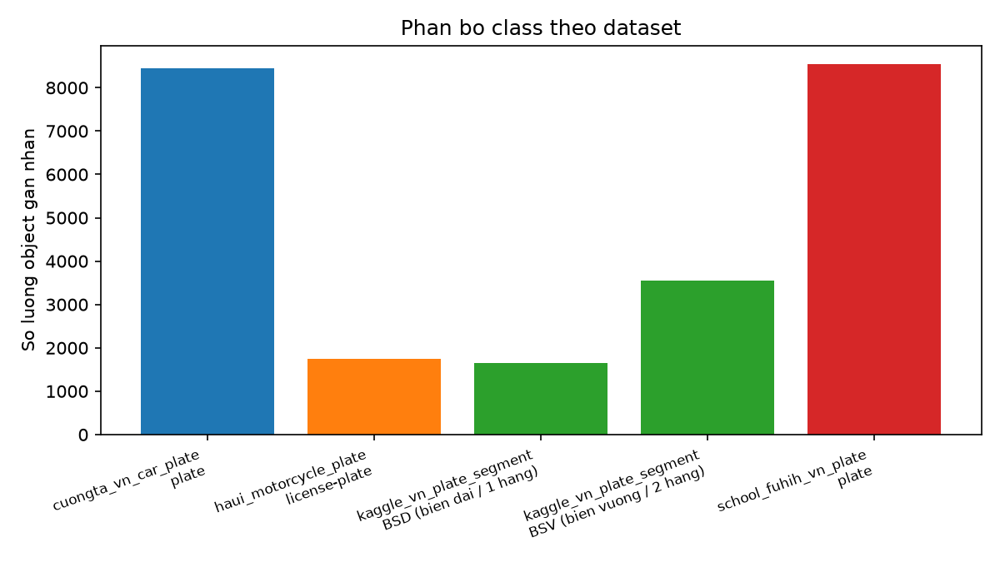
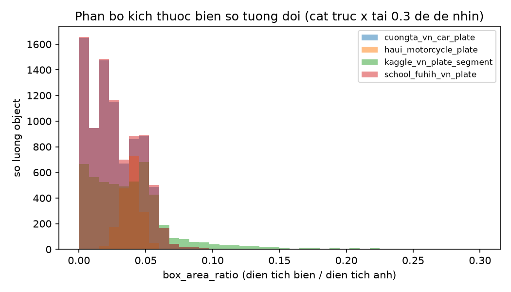
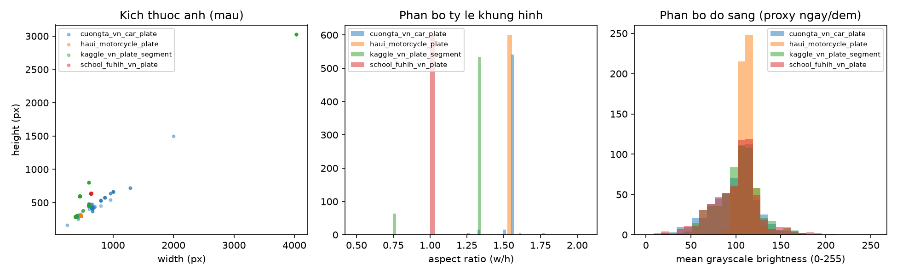
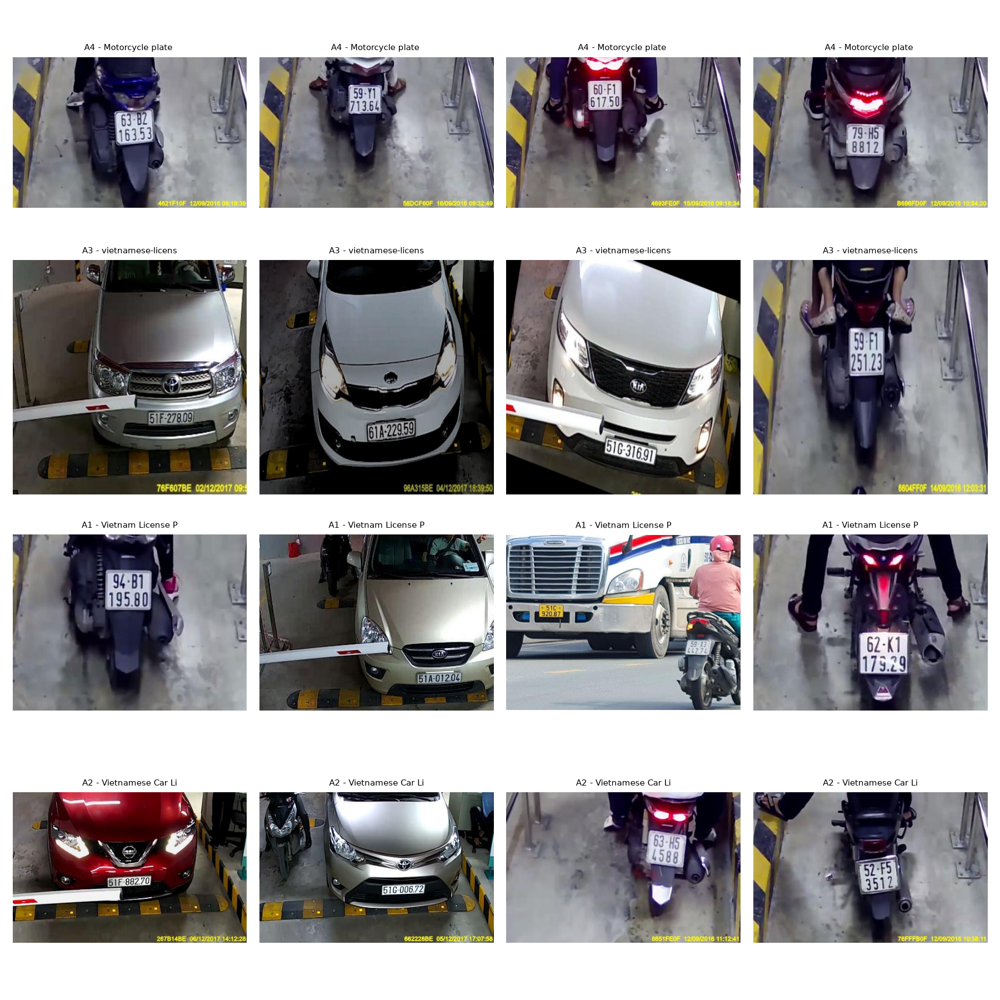

# Chương 2: Thu thập và xử lý dữ liệu

Chương này trình bày quá trình tìm hiểu, đánh giá và bước đầu lựa chọn dữ liệu công khai cho bài toán phát hiện biển số xe, tương ứng với Tuần 2 trong kế hoạch đồ án.

## 2.1 Khảo sát bộ dữ liệu công khai

Trước khi tự chụp hay gắn nhãn dữ liệu, nhóm tìm xem đã có sẵn dataset công khai nào dùng được chưa. Đã xem qua 14 dataset, chia làm 3 nhóm: (A) biển số Việt Nam, (B) phương tiện/bối cảnh đường phố Việt Nam, (C) các dataset ALPR/bãi xe nước ngoài để đối chiếu. Ghi chép chi tiết quá trình tìm và kiểm tra từng nguồn (license, mô tả gốc, ngày kiểm tra) nằm ở [`docs/research/2026-07-30-parking-vehicle-plate-datasets.md`](../../research/2026-07-30-parking-vehicle-plate-datasets.md), phần dưới đây chỉ tóm tắt lại.

### 2.1.1 Nhóm A — Biển số Việt Nam

| Ký hiệu | Tên / nguồn | Host | Số ảnh | Classes | License | Biển 1 hàng/2 hàng? |
|---|---|---|---|---|---|---|
| A1 | Vietnam License Plate Segment (duydieunguyen) | Kaggle | ~5.000 | 2 (1 hàng: 3.510 / 2 hàng: 1.625) | Unknown — cần hỏi lại tác giả | Có, tách rõ số lượng |
| A2 | Vietnamese Car License Plate (Cuong Ta) | Roboflow | 8.255 | 1 (plate, không OCR) | CC0 1.0 | Không rõ tỷ lệ |
| A3 | vietnamese-license-plate-tptd0 (school-fuhih) | Roboflow | 8.397 | 1 (plate, không OCR) | CC BY 4.0 | Không rõ tỷ lệ |
| A4 | Motorcycle License Plate (HaUI) | Roboflow | 1.748 | 1 (plate, không OCR) | MIT | Thiên về xe máy (2 hàng), chưa rõ tỷ lệ chính xác |
| A5 | greenParking (thaiphung) | Roboflow | 1.748 | 1 (không đặt tên) | CC BY 4.0 | Không xác định — trang không có mô tả |
| A6 | Viet Nam OCR plate (license-plate-reg) | Roboflow | 3.819 | 32 (theo ký tự, có OCR ground truth) | CC0 1.0 | Không rõ tỷ lệ |
| A7 | VNLicensePlate_yolov7 (bomaich) | Kaggle | 1.000 | plate (1&2 hàng nhưng gộp chung) | Unknown — cần hỏi lại | Có, nhưng không tách số |

Không dataset nào ở nhóm A ghi rõ điều kiện ánh sáng hay bối cảnh chụp trong mô tả — muốn biết thật sự phải tải về xem, việc này làm ở mục 2.2. A5 bị loại vì trang không có mô tả gì để đối chiếu, A7 bị loại vì mẫu nhỏ và không tách biển 1 hàng/2 hàng theo số lượng như A1.

Sau khi xem trực tiếp ảnh mẫu, A2 (Cuong Ta) hóa ra có độ đa dạng biển số khá tốt cho nhiều loại xe, không chỉ ô tô như tên gợi ý. Cùng với A1, đây là 2 dataset nhóm ưu tiên xem xét thêm cho riêng bài toán detect vùng biển số (xem `docs/research/2026-07-30-parking-vehicle-plate-datasets.md`, mục A).

### 2.1.2 Nhóm B — Phương tiện, bối cảnh đường phố/bãi xe Việt Nam

| Ký hiệu | Tên / nguồn | Host | Số ảnh | Classes | License | Ghi chú |
|---|---|---|---|---|---|---|
| B1 | Vietnamese vehicle (car-classification, v3) | Roboflow | 1.547 | 8 lớp "remapped", chưa xem được danh sách cụ thể | CC BY 4.0 | Mô tả gốc là 4 lớp car/bus/truck/motorcycle trước khi remap |
| B2 | Vehicle Vietnam-CanTho | Roboflow | 1.110–1.746 | 4 (Car/Truck/Bus/Motorbike) | CC BY 4.0 | Chỉ có ảnh ban ngày, đường phố Cần Thơ |
| B3 | UIT-CVID21 (UIT-Together) | GitHub (UIT) | 10.000 (chưa xem được thật) | 4 (Bus/Car/Truck/Van) | Không rõ — repo trả 404 khi mở | Chụp từ drone, khác góc camera cổng bãi xe |
| B4 | QuangTranUTE/Vehicle-Detection | GitHub | ~11.000 | Không rõ | Không rõ | Camera giám sát giao thông, không phải bãi xe |

Ở nhóm B chưa thấy dataset Việt Nam nào tách phương tiện theo kiểu dáng (sedan/SUV/pickup) — tất cả chỉ dừng ở mức "Car" chung. Đây là lý do sau đó nhóm phải tìm thêm dataset riêng cho việc phân loại kiểu dáng xe (ghi trong `docs/research/2026-07-30-vehicle-classification-datasets.md`, sẽ dùng ở chương Tuần 5).

### 2.1.3 Nhóm C — ALPR/bãi xe nước ngoài (đối chiếu)

| Ký hiệu | Tên / nguồn | Số ảnh | License | Bối cảnh | Ánh sáng |
|---|---|---|---|---|---|
| C1 | CCPD (Trung Quốc) | \>300.000 | MIT | Bãi xe TQ | 61,4% ngày / 38,6% đêm — dataset duy nhất định lượng rõ tỷ lệ này |
| C2 | PKLot (Brazil) | 12.416 (+695k patch) | CC BY 4.0 | Bãi xe ngoài trời | Nhiều kiểu thời tiết nhưng không có ảnh đêm |
| C3 | CNRPark(+EXT) (Ý) | 12.000 (+~145–150k patch) | Chưa kiểm tra được (lỗi certificate khi truy cập) | Bãi xe ngoài trời | Nhiều thời tiết, có cả ảnh đêm/thiếu sáng |
| C4 | AOLP (Đài Loan) | 2.049 | Chỉ dùng học thuật, cấm thương mại, phải xin phép bằng văn bản | Cổng ra vào/phạt nguội/tuần tra | 3 kịch bản góc chụp khác nhau |
| C5 | OpenALPR benchmarks (US/EU/BR) | EU 108 / US ~222 | AGPL-3.0 | Chỉ dùng đối chiếu, quy mô nhỏ | Không kiểm tra |

Nhóm C dùng biển số nước ngoài nên không dùng để train OCR biển VN được, nhưng CCPD (C1) có thể tham khảo để pretrain phần detect vùng biển số nói chung, vì đây là dataset duy nhất trong cả 3 nhóm có số liệu ngày/đêm rõ ràng — điều mà cả nhóm A lẫn B đều thiếu.

### 2.1.4 Đánh giá và hướng chọn ban đầu

Không dataset nào trong 14 bộ trên vừa có biển VN tách 1 hàng/2 hàng, vừa có ánh sáng đa dạng được định lượng, vừa đúng bối cảnh camera cổng bãi xe cùng lúc. Từ bảng so sánh trên, nhóm chọn A3, A4, A1 để tìm hiểu kỹ hơn (tải về và làm EDA ở mục 2.2), vì đây là 3 dataset có license rõ ràng nhất trong nhóm cỡ mẫu đủ lớn (A1 vẫn cần xác nhận lại license với tác giả), và A1 là dataset duy nhất tách rõ số lượng theo loại biển. Việc chốt dataset chính thức dùng để huấn luyện sẽ làm sau khi có kế hoạch gắn nhãn cụ thể (mục 2.3) — phần 2.1 và 2.2 chủ yếu ghi lại quá trình tìm hiểu để làm căn cứ cho quyết định đó.

## 2.2 Phân tích khám phá dữ liệu (EDA)

Mô tả trên trang Roboflow/Kaggle không nói gì về ánh sáng hay bối cảnh chụp, nên nhóm tải cả 3 dataset về và tự làm EDA bằng notebook [`src/ml/notebooks/eda-plate-datasets.ipynb`](../../../src/ml/notebooks/eda-plate-datasets.ipynb) để xem thực tế thế nào. Số liệu tổng hợp lưu ở [`docs/research/eda_outputs/eda_summary.csv`](../../research/eda_outputs/eda_summary.csv):

| Dataset | Số ảnh | Số object | Độ phân giải (px) | Độ sáng TB | % ảnh tối |
|---|---|---|---|---|---|
| A3 | 8.357 | 8.548 | 640×640 (cố định) | 100,7 | 12,8% |
| A4 | 1.748 | 1.748 | 472×303 (cố định) | 111,1 | 0,0% |
| A1 | 4.578 | 5.200 | 380–4032 × 285–3024 | 102,1 | 10,7% |

*(Độ sáng đo trên mẫu ngẫu nhiên n=600 ảnh/bộ, seed cố định = 42, để không phải đọc hết 14.683 ảnh)*

### 2.2.1 Phân bố class và kích thước biển số

Ở A1, lớp `BSV` (biển 2 hàng, 3.559 đối tượng) nhiều gấp khoảng 2,2 lần lớp `BSD` (biển 1 hàng, 1.641 đối tượng). Nếu gộp cả 3 dataset lại để train thì cần để ý điểm lệch này, không thì model sẽ học thiên về biển 2 hàng.

Biểu đồ trên là tỉ lệ diện tích vùng biển số so với cả ảnh (`box_area_ratio`), dùng để đoán ảnh là cận cảnh biển số hay chụp xa. Trung bình chỉ khoảng 0,028–0,043 ở cả 3 bộ, tức là phần lớn ảnh chụp toàn cảnh đầu xe chứ không phải cận cảnh sát biển số.

### 2.2.2 Kích thước ảnh và độ sáng

Khi đo kích thước ảnh mới phát hiện ra là A3 và A4 đã bị Roboflow resize về đúng một kích thước cố định lúc export (640×640 cho A3, 472×303 cho A4 — độ lệch chuẩn kích thước bằng 0), nên độ phân giải gốc coi như mất hết. Chỉ A1 (tải trực tiếp từ Kaggle, không qua Roboflow) là còn giữ được kích thước gốc, dao động 380 đến 4032 pixel chiều rộng.

Vì không dataset nào có nhãn ánh sáng thật, nhóm dùng độ sáng trung bình ảnh xám (thang 0–255) làm proxy tạm: dưới 70 coi là tối/thiếu sáng, trên 190 là quá sáng. A4 gần như không có biến thiên gì (gần 100% rơi vào mức "bình thường"), còn A3 và A1 có khoảng 11–13% ảnh rơi vào mức tối. Đây chỉ là proxy dựa theo độ sáng pixel thôi, không phải nhãn thật về điều kiện chụp (trong nhà/ngoài trời, ngày/đêm).

### 2.2.3 Xem ảnh mẫu để kiểm tra bối cảnh

Ban đầu, do trang Roboflow/Kaggle không mô tả gì về điều kiện chụp, nhóm nghĩ có thể phải tự chụp thêm gần như toàn bộ ảnh ở bối cảnh cổng bãi xe. Nhưng khi mở thử vài chục ảnh mẫu ra xem thì hóa ra cả 3 dataset đều là ảnh chụp thật từ camera cổng bãi xe/hầm gửi xe, có thanh chắn (boom barrier) trong khung hình — đúng bối cảnh đồ án cần, không phải ảnh đường phố chụp ngẫu nhiên như suy đoán ban đầu. Nhiều ảnh còn có timestamp cháy vào góc kiểu camera an ninh DVR, và có vài ảnh chụp trong hầm xe thiếu sáng. Đây là bài học rút ra: mô tả text trên trang dataset không đủ để đánh giá, phải tải và xem ảnh thật mới biết chắc được.

## 2.3 Công việc tiếp theo

Nhóm dùng ba dataset A3, A4, A1 làm nền chính, không tự chụp thêm. Việc còn lại là thống nhất quy ước gắn nhãn (định dạng, tên lớp) giữa các nguồn khác nhau và chia train/validation/test chung cho cả 3 bộ, sẽ làm ở bước tiếp theo trong Tuần 2.

---

**Tài liệu tham khảo:**
- Xu, Z. et al. (2018). "Towards End-to-End License Plate Detection and Recognition: A Large Dataset and Baseline." ECCV. (CCPD)
- Almeida, P. R. L. et al. (2015). "PKLot — A Robust Dataset for Parking Lot Classification." Expert Systems with Applications.
- Amato, G. et al. (2017). "Deep Learning for Decentralized Parking Lot Occupancy Detection." Expert Systems with Applications. (CNRPark+EXT)
