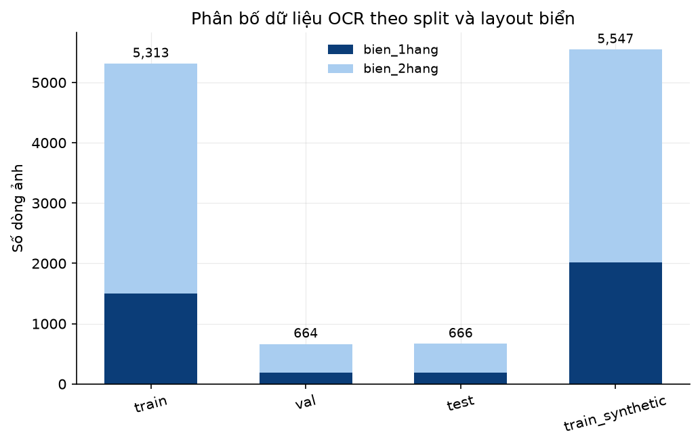
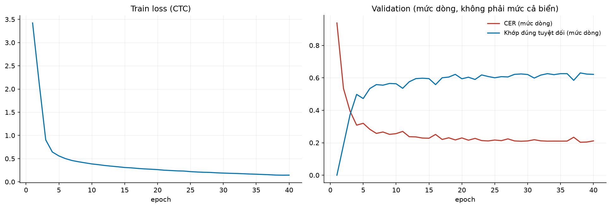
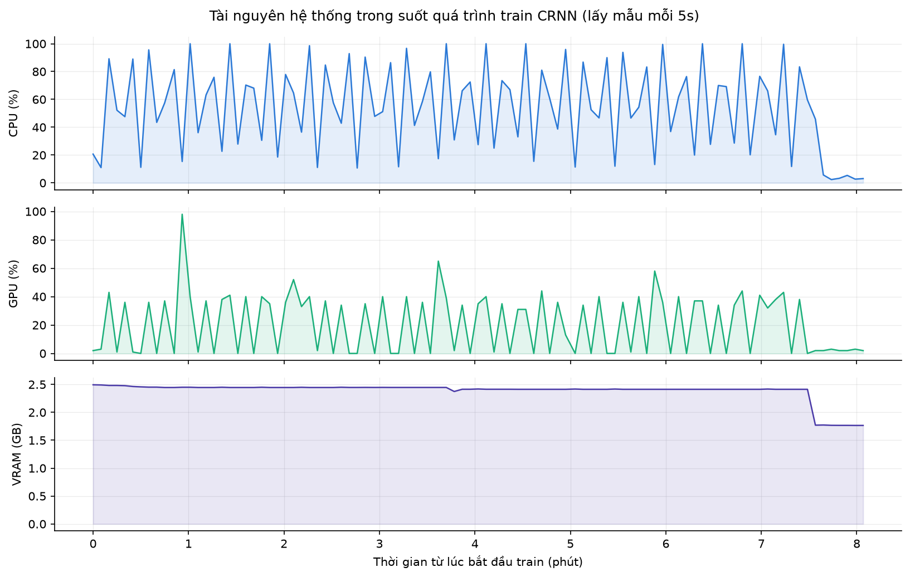
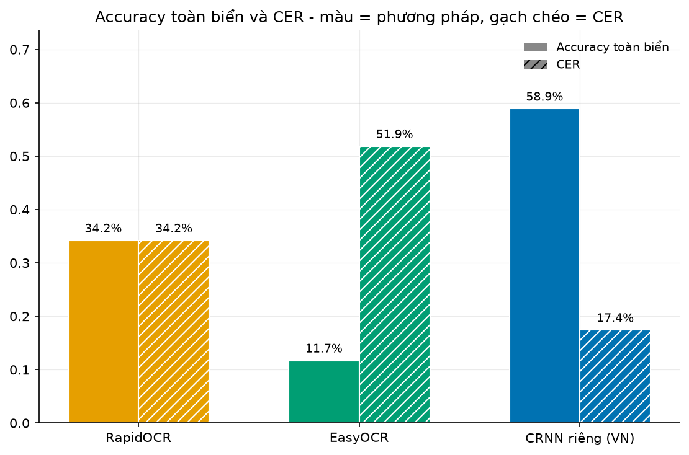
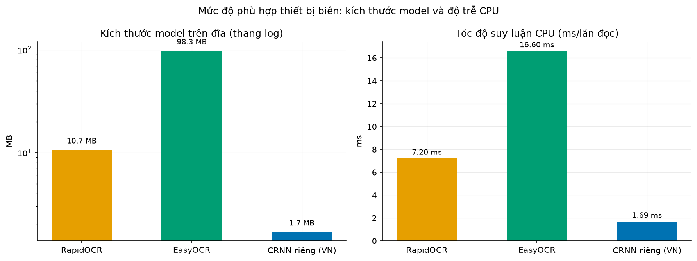
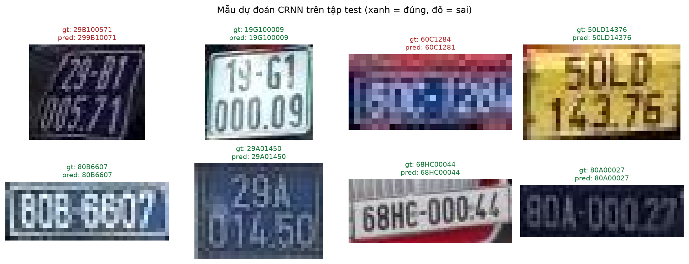

# Chương 4: Đọc ký tự biển số (OCR)

Chương này trình bày module đọc ký tự biển số, bước tiếp theo sau phát hiện và cắt biển số (module `plate_detection_pipeline`). 
Phạm vi: đọc chuỗi ký tự trên crop biển số đã cắt sẵn, cho cả hai bố cục biển theo quy định biển số Việt Nam (xem `docs/research/quy-dinh-bien-so-xe-vn.md`): 
- **biển 1 dòng** (biển dài, gắn ở ô tô)
- **biển 2 dòng** (biển ngắn, gắn ở xe máy và cũng là biển ngắn của ô tô). Việc ghép với bước phát hiện để chạy end-to-end thuộc phạm vi Tuần 6.

## 4.1 Dữ liệu

### Dữ liệu huấn luyện

Nguồn: **topkek_plate_ocr** (Kaggle `topkek69/vietnamese-license-plate-ocr`, giấy phép Apache-2.0), gồm 6.643 crop biển thật và 5.547 crop biển sinh tổng hợp, nhãn là chuỗi ký tự đi kèm từng ảnh (ví dụ `30F 11292`).

Bố cục biển không có nhãn sẵn nên được suy từ tỉ lệ khung ảnh (rộng/cao < 2,0 coi là 2 dòng), dùng chung ngưỡng và tên lớp (`bien_1hang`/`bien_2hang`) với module phát hiện, để dữ liệu đánh giá và dữ liệu suy luận thống nhất một quy ước.

Chia tập 80/10/10 phân tầng theo bố cục, giữ crop sinh tổng hợp riêng và chỉ dùng khi huấn luyện:

| Split | Biển 1 dòng | Biển 2 dòng | Tổng |
|---|---:|---:|---:|
| train | 1.496 | 3.817 | 5.313 |
| val | 187 | 477 | 664 |
| test | 188 | 478 | 666 |
| train_synthetic | - | - | 5.547 |

### Tập test độc lập

Tập test của topkek có cùng nguồn gốc với tập huấn luyện nên chưa đủ để đánh giá khả năng tổng quát hoá. Nhóm xây thêm một tập test độc lập từ **vn_plate** (Roboflow "Vietnam license-plate", giấy phép CC BY 4.0, 1.005 ảnh), bộ này có sẵn bounding box biển nhưng không có nhãn chuỗi ký tự.

Cách làm: cắt biển theo bounding box có sẵn, lấy ngẫu nhiên 100 biển (seed cố định), xuất thành lưới ảnh **không kèm bất kỳ dự đoán nào của model**, rồi đọc và gán nhãn thủ công.

Kết quả gán nhãn: **96/100 biển đọc được**, 45 biển 1 dòng và 51 biển 2 dòng. Bốn biển còn lại (4,0%) ảnh rất mờ, bạc màu hoặc bị cắt mất ký tự, được loại khỏi tập test thay vì đoán.

Điểm quan trọng nhất của tập này là độ phân giải sát điều kiện triển khai hơn hẳn:

| Nguồn | px mỗi dòng ký tự (trung vị) | Tỉ lệ đạt ≥40px/dòng |
|---|---:|---:|
| topkek (huấn luyện và test chính) | 19 | 21,9% |
| **vn_plate (test độc lập)** | **52** | **88,0%** |

## 4.2 Kiến trúc

Nhóm so sánh model tự huấn luyện với hai engine OCR pretrained làm mốc:

- **RapidOCR**: model PP-OCRv3 nhận dạng ký tự, chạy qua ONNX Runtime thuần. Ban đầu dự định dùng PaddleOCR trực tiếp theo khuyến nghị chung cho OCR biển số, nhưng gói `paddlepaddle` chưa có bản hỗ trợ Python 3.14 của môi trường huấn luyện; RapidOCR đóng gói lại cùng dòng model PP-OCR để chạy thuần ONNX Runtime nên thay thế được mà vẫn giữ đúng tinh thần khuyến nghị.
- **EasyOCR**: model CRNN pretrained (PyTorch), charset tiếng Anh.
- **CRNN riêng** (`src/ml/training/ocr_model.py`): CNN 5 lớp (32 -> 64 -> 96 -> 96 -> 96 kênh) + 1 lớp BiLSTM (96 chiều ẩn) + đầu ra CTC. Ảnh vào 1 kênh xám 48×128px, chuỗi đặc trưng đầu ra 32 bước thời gian, dư so với nhãn dài nhất khoảng 9 ký tự để CTC có chỗ chèn ký tự blank. Chỉ 424.933 tham số, nhỏ vì charset thu hẹp còn đúng 36 ký tự (0-9, A-Z).

Cả ba dùng chung luồng xử lý ở `src/ml/pipeline/ocr.py` theo thứ tự: chỉnh hình học → tách dòng nếu là biển 2 dòng → OCR từng dòng → ghép chuỗi → chuẩn hoá theo quy tắc ký tự biển số Việt Nam. Nhờ dùng chung luồng này, ba phương pháp hoán đổi được cho nhau qua cùng một hàm `read_plate()`.

### Nắn phối cảnh thay cho xoay phẳng

Bản đầu chỉ chỉnh nghiêng bằng `minAreaRect` (xoay trong mặt phẳng ảnh). Thử nghiệm trên biển cắt từ A1 (ảnh cổng bãi xe thật) cho thấy cách này không xử lý được biến dạng phối cảnh, vốn là điều kiện thường gặp ở bãi giữ xe: camera gắn cao và lệch bên nên hầu như luôn nhìn chéo vào biển. 

Nhóm bổ sung `perspective_correct()`: nắn 4 góc biển về hình chữ nhật phẳng bằng `cv2.getPerspectiveTransform`. Toạ độ 4 góc lấy từ nhãn polygon của A1, và khi tích hợp thật sẽ lấy từ đầu ra segmentation của model phát hiện.

Đếm tay trên các biển đọc được bằng mắt trong tập A1:

| Cách xử lý hình học | Đọc đúng |
|---|---:|
| Xoay phẳng (`deskew`) | 8/18 (44%) |
| **Nắn phối cảnh 4 điểm** | **13/17 (76%)** |

Một chi tiết kỹ thuật đáng lưu ý: cách sắp xếp 4 góc theo tổng và hiệu toạ độ (cách thường gặp) chọn trùng điểm khi biển nghiêng gần 45 độ, làm ma trận biến đổi suy biến và ảnh nắn ra trống trơn. Bản hiện tại sắp góc theo góc quay quanh tâm tứ giác, luôn cho đủ 4 điểm phân biệt với tứ giác lồi.

## 4.3 Huấn luyện và các thí nghiệm cải tiến

Cấu hình chung: Adam, learning rate 1e-3, batch size 64, 40 epoch, `CTCLoss`, chạy trên GPU NVIDIA RTX 4070. Mỗi mẫu huấn luyện là **một dòng ký tự đơn**: biển 2 dòng được tách thành 2 mẫu bằng hàm `split_rows()` dùng lúc suy luận. Augmentation gồm xoay ±4 độ, biến dạng phối cảnh nhẹ ngẫu nhiên, chỉnh sáng tối ±25 và làm mờ Gauss.

Module này trải qua ba vòng cải tiến dựa trên số liệu đo được ở mỗi bước, trình bày theo đúng thứ tự đã làm.

### Vòng 1: hạ cấp dữ liệu sinh tổng hợp

Đo trực tiếp cho thấy ảnh sinh tổng hợp và crop thật có phân phối rất khác nhau:

| | Ảnh sinh tổng hợp | Crop thật |
|---|---:|---:|
| px/dòng ký tự (trung vị) | 45-50 | 19 |
| Tỉ lệ >= 40px/dòng | 100% | 7,0% |

Ảnh sinh tổng hợp là biển render sắc nét, không nhiễu và không nghiêng, chiếm khoảng một nửa dữ liệu huấn luyện. Ba hướng xử lý được đưa ra thí nghiệm có kiểm soát (chỉ khác nhau ở cách dùng ảnh sinh tổng hợp, mọi yếu tố khác giữ nguyên): giữ nguyên (V0), bỏ hẳn (V1), và **hạ cấp có chủ đích** cho khớp phân phối ảnh thật bằng cách thu nhỏ về mức px/dòng lấy ngẫu nhiên theo đúng phân phối thực nghiệm rồi thêm nhiễu Gauss và nén JPEG chất lượng thấp (V2).

| Biến thể | topkek test | vn_plate test |
|---|---:|---:|
| V0 nguyên bản | 51,1% | 62,5% |
| V1 chỉ ảnh thật | 49,5% | 51,0% |
| **V2 hạ cấp** | **54,2%** | **64,6%** |

V2 cho kết quả tốt hơn trên cả hai tập test độc lập nhau. V1 kém nhất, xác nhận rằng bỏ dữ liệu đi là hướng sai kể cả khi dữ liệu đó lệch phân phối; kết luận này khớp với một thí nghiệm trước đó trong tuần (lọc bỏ crop dưới 25px/dòng khi huấn luyện): model bị mất 36% dữ liệu, overfit rõ (train loss giảm sâu hơn nhưng CER validation lại xấu đi), và kém hơn hẳn ở mọi dải độ phân giải kể cả dải mà nó được huấn luyện riêng cho. Bài học chung của cả hai thí nghiệm: với bài toán này, số lượng dữ liệu quan trọng hơn độ sạch của dữ liệu.

### Vòng 2: sửa lỗi chia nhãn biển 2 dòng

Nhãn biển 2 dòng trong tập dữ liệu chỉ là một chuỗi ghép (ví dụ `68P27299`), không có thông tin đâu là dòng trên đâu là dòng dưới, trong khi ảnh đã bị tách vật lý thành 2 nửa để đưa vào model. Bản đầu dùng một hàm suy đoán: thử cắt 3 ký tự đầu trước, nếu phần còn lại có độ dài 4 hoặc 5 thì chấp nhận luôn.

Kiểm tra lại bằng nhãn gốc (`label_raw`) mới phát hiện topkek giữ nguyên dấu cách đúng ở ranh giới 2 dòng thật (ví dụ `"60F1 64727"`), chỉ bị xoá mất khi làm sạch dữ liệu ban đầu. Đối chiếu hàm đoán cũ với ranh giới thật này: **sai 405/3.817 = 10,6% nhãn biển 2 dòng**. Cơ chế lỗi: nhãn 8 ký tự có thể là 3+5 hoặc 4+4, hai khả năng đều hợp lệ về độ dài nên hàm đoán không phân biệt được, và luôn chọn nhầm 3+5 trong các trường hợp đúng ra phải là 4+4. Hậu quả cụ thể: model được cho xem nửa ảnh trên chứa 4 ký tự nhưng bị dạy đáp án đúng chỉ có 3, nên học được thói quen bỏ mất ký tự cuối dòng trên.

Đây là lỗi ở dữ liệu huấn luyện, không phải giới hạn của kiến trúc: cùng một CRNN, biển 1 dòng (không qua bước chia nhãn này) vẫn đạt kết quả tốt trong khi biển 2 dòng bị kéo xuống thấp hẳn, và sau khi sửa thì khoảng cách giữa hai loại biển gần như biến mất (xem 4.4).

Cách sửa: thay hàm đoán bằng việc tách nhãn tại đúng dấu cách trong `label_raw`, chỉ lùi về cách đoán cũ cho khoảng 0,03% nhãn hiếm không có dấu cách.

### Vòng 3: kiểm soát nhiễu ngẫu nhiên giữa các lần huấn luyện

Lần huấn luyện đầu tiên sau khi sửa nhãn (không cố định seed) cho kết quả tốt hơn rõ rệt trên cả hai tập test, nhưng khi kiểm tra vào từng lỗi cụ thể lại phát hiện một lỗi mới: chữ cái `G` ở vị trí seri bị đọc nhầm thành `D` hoặc `0` với độ tin cậy cao (0,96-0,99), sai 7/13 biển có seri `G` trong tập vn_plate, dù trước đó model cũ (V2) đọc đúng cả 13/13.

Vì mã nguồn không cố định seed ngẫu nhiên (khởi tạo trọng số, thứ tự xáo trộn dữ liệu, tham số augmentation), không thể kết luận ngay lỗi này do việc sửa nhãn gây ra hay chỉ là may rủi giữa các lần train. Nhóm bổ sung tham số `seed` cho `train_crnn()` và huấn luyện lại hai lần với seed cố định khác nhau (42 và 123) để kiểm tra độ lặp lại:

| Seed | Lỗi seri G (trên 13 biển) | Accuracy vn_plate |
|---|---:|---:|
| Không cố định (lần đầu) | 7/13 | 80,2% |
| seed 42 | 3/13 | 87,5% |
| seed 123 | 1/13 | 92,7% |

Cả ba lần đều dùng đúng một cấu hình và một tập dữ liệu, chỉ khác giá trị khởi tạo ngẫu nhiên, mà kết quả dao động 80,2% đến 92,7%, biên độ đủ lớn để một kết luận rút ra từ một lần train duy nhất, không kiểm soát seed, có thể sai lệch đáng kể. Lỗi seri G giảm dần qua các lần chạy lại chứ không lặp lại ổn định, nên nhiều khả năng là nhiễu ngẫu nhiên bị khuếch đại bởi cỡ mẫu nhỏ (chỉ 13 biển có seri G trong tập test) chứ không phải hệ quả tất yếu của việc sửa nhãn.

**Quyết định chọn model:** hai seed 42 và 123 có `val_row_cer` gần như ngang nhau (0,2030 so với 0,2054), tức không có căn cứ độc lập với tập test để nói seed nào "tốt hơn". Chọn seed 123 chỉ vì nó đạt điểm cao nhất trên đúng 96 biển test sẽ biến tập test độc lập thành công cụ chọn model, làm mất tính khách quan của số liệu báo cáo. Nhóm chốt **seed 42** (giá trị mặc định, không phải seed chọn sau khi đã biết kết quả trên test) làm model chính thức, và báo cáo minh bạch cả khoảng dao động giữa các lần chạy thay vì chỉ nêu con số đẹp nhất.

## 4.4 Kết quả

### So sánh với hai engine pretrained

Đánh giá ở mức cả biển số trên tập test topkek (666 crop thật), cùng một tập cho cả ba phương pháp, dùng model CRNN cuối cùng (đã sửa nhãn, seed 42):

| Phương pháp | Accuracy toàn biển | CER | Kích thước model | CPU inference |
|---|---:|---:|---:|---:|
| RapidOCR | 34,23% | 34,22% | 10,7 MB | 7,20 ms |
| EasyOCR | 11,71% | 51,87% | 98,3 MB | 16,65 ms |
| **CRNN riêng** | **58,9%** | **17,43%** | **1,7 MB** | **1,69 ms** |

*(Kích thước model là dung lượng thật cần có để chạy; với EasyOCR gồm cả model phát hiện văn bản lẫn model nhận dạng vì API `readtext()` dùng cả hai. CPU inference đo trên máy huấn luyện, không phải Raspberry Pi 5, và tính cho một lần đọc; biển 2 dòng cần hai lần đọc.)*

CRNN riêng vượt cả hai baseline trên mọi tiêu chí cùng lúc: chính xác hơn nhiều lần, nhỏ hơn RapidOCR khoảng 6 lần và nhỏ hơn EasyOCR khoảng 58 lần, nhanh hơn cả hai trên CPU. Nguyên nhân là phạm vi bài toán, không phải kiến trúc "thông minh" hơn: hai model pretrained mang charset tổng quát, trong khi CRNN riêng chỉ cần phân biệt đúng 36 ký tự cố định.

### Kết quả trên tập test độc lập

| | topkek (n=666) | vn_plate (n=96) |
|---|---:|---:|
| Accuracy toàn biển | 58,9% | 87,5% |
| CER | 17,43% | 1,97% |
| Biển 1 dòng | 65,4% | 86,7% |
| Biển 2 dòng | 56,3% | 88,2% |

Điểm quan trọng nhất: **khoảng cách giữa biển 1 dòng và biển 2 dòng gần như biến mất** trên tập vn_plate (86,7% so với 88,2%), so với trước khi sửa lỗi chia nhãn (88,9% so với 43,1%). Đây là bằng chứng trực tiếp cho thấy hạn chế cũ nằm ở dữ liệu huấn luyện chứ không phải bản chất bài toán biển 2 dòng khó hơn.

### Vì sao accuracy trên topkek thấp hơn hẳn vn_plate

Cùng một model, đo trên hai tập test cho hai con số cách nhau tới 30 điểm phần trăm (58,9% so với 87,5%). Tách theo dải độ phân giải trên chính model cuối cho thấy đây không phải model không ổn định, mà do tỉ lệ ảnh khó giữa hai tập rất khác nhau:

| Dải độ phân giải | Tỉ lệ trong topkek | Accuracy (topkek) | Tỉ lệ trong vn_plate | Accuracy (vn_plate) |
|---|---:|---:|---:|---:|
| dưới 20px/dòng | 52,3% | 46,6% | 0% | - |
| 20-30px | 25,8% | 61,6% | 1,0% | 100% |
| 30-40px | 14,6% | 80,4% | 11,5% | 100% |
| **từ 40px trở lên** | 7,4% | **93,9%** | 87,5% | 85,7% |

Ở đúng dải ảnh đủ nét (từ 40px/dòng trở lên), model đạt 93,9% trên topkek, vượt mục tiêu trên 90% của đề cương. Nhưng dải đó chỉ chiếm 7,4% tập test topkek; hơn nửa tập test (52,3%) rơi vào dải dưới 20px, nơi nhiều ảnh gần như không đọc được kể cả bằng mắt người, kéo accuracy trung bình toàn tập xuống còn 58,9%. Tập vn_plate có phân bố ngược lại (87,5% ảnh đã ở dải từ 40px trở lên) nên accuracy trung bình toàn tập cao hơn hẳn, dù dùng chung một model.

Kết luận rút ra: **con số accuracy toàn tập chỉ có ý nghĩa khi đọc kèm phân bố độ phân giải của tập đó**, so sánh 58,9% với 87,5% như hai chỉ số ngang hàng là sai lệch, vì thực chất chúng phản ánh cùng một model trên hai phân phối ảnh khác nhau. Bảng phân tầng theo độ phân giải là số liệu đáng tin hơn để đánh giá năng lực thật của model, và đó cũng là con số cần đối chiếu khi quyết định yêu cầu kỹ thuật cho camera lắp đặt.

## 4.5 Hậu xử lý theo quy định biển số Việt Nam

Sau khi ghép chuỗi, kết quả được chuẩn hoá theo quy tắc định dạng biển số: sửa nhầm lẫn ký tự theo vị trí kỳ vọng (vị trí số quy về chữ số `O→0`, `I→1`, `B→8`, `S→5`, `Z→2`; vị trí seri quy về chữ cái), rồi kiểm tra khớp định dạng.

**Seri có thể gồm một hoặc hai chữ cái.** Điểm này quan trọng hơn dự kiến ban đầu vì bối cảnh pháp lý thay đổi ngay trong thời gian thực hiện đồ án. Theo Thông tư 79/2024/TT-BCA có hiệu lực từ 01/01/2025, biển số xe máy được thống nhất seri **hai chữ cái** kèm 5 chữ số, không phân biệt dung tích; biển seri cũ dạng một chữ một số chỉ được sử dụng đến hết 31/12/2025. Ngoài ra còn các ký hiệu đặc biệt hai chữ cái vẫn lưu hành như `LD` (xe liên doanh), `DA` (xe dự án), `NG` và `QT` (ngoại giao, tổ chức quốc tế). Đo trên dữ liệu hiện có, tỉ lệ biển seri hai chữ cái đã chiếm 15-19% tập topkek (`60AA`, `29BF`, `36BC`, `51ZA`, `50LD`, `15HC`...).

Biểu thức kiểm tra định dạng nhận cả hai trường hợp: mã tỉnh 2 chữ số, seri 1 hoặc 2 chữ cái, rồi 4 đến 6 chữ số.

**Xác định chỗ ngắt khi hiển thị.** Chuỗi ghép từ biển 2 dòng có thể mơ hồ: `60F21234` vừa có thể là `60F-212.34` vừa có thể là `60F2-1234`, cả hai đều hợp lệ về định dạng. Bố cục ảnh gốc giải quyết được điều này: với biển 2 dòng, dòng trên chính là phần mã tỉnh cộng seri, nên độ dài dòng trên mà OCR đọc được cho biết chính xác chỗ ngắt, không cần suy đoán. Khi không có thông tin bố cục (biển 1 dòng) thì mới suy đoán theo độ dài phần số.

## 4.6 Thảo luận

**Ba nguyên nhân đã xác định, ba cách xử lý khác nhau.** Tuần này cho thấy accuracy thấp không phải một vấn đề duy nhất mà là tổng của nhiều nguyên nhân độc lập, mỗi nguyên nhân cần một cách xử lý khác nhau và không thể gộp chung: chất lượng ảnh đầu vào (xử lý bằng cách thêm dữ liệu đúng phân phối, không phải lọc bớt), góc chụp chéo (xử lý bằng hình học, nắn phối cảnh, không cần model tốt hơn), và lỗi ở khâu chuẩn bị nhãn (xử lý bằng cách quay lại nguồn dữ liệu gốc, không phải đổi kiến trúc). Bài học chung: trước khi kết luận "model chưa đủ tốt", cần loại trừ khả năng dữ liệu huấn luyện hoặc quy trình đánh giá đang có lỗi.

**Nhiễu ngẫu nhiên giữa các lần train là một nguồn sai số cần kiểm soát tường minh**, đặc biệt khi tập test chỉ có quy mô nhỏ. Chênh lệch 80,2% đến 92,7% giữa các lần chạy cùng cấu hình cho thấy nếu chỉ train một lần và báo cáo kết quả, con số đó có thể lạc quan hoặc bi quan hơn thực tế khá nhiều. Cố định seed và huấn luyện lặp lại là cách kiểm soát trực tiếp; chọn model theo chỉ số độc lập với tập test (ở đây là `val_row_cer`) thay vì theo điểm số cao nhất trên tập test là cách tránh việc vô tình biến tập test thành một phần của quá trình huấn luyện.

**Yêu cầu kỹ thuật rút ra cho việc lắp camera.** Từ phân tầng độ phân giải đã đo ở các thí nghiệm trước, để đạt kết quả tốt cần crop biển đạt tối thiểu khoảng 40px cho mỗi dòng ký tự. Điều này phụ thuộc vào khung hình chứ không đơn thuần số megapixel: đo trên A1 cho thấy ảnh gốc rộng tới 4032px nhưng biển vẫn chỉ chiếm khoảng 31px mỗi dòng vì xe ở xa. Cần đặt camera gần hơn hoặc thu hẹp góc nhìn vào khu vực cổng, không phải mua camera độ phân giải cao hơn.

**Giới hạn của tập test.** 96 biển là cỡ mẫu nhỏ; kết hợp với phát hiện ở vòng 3 về nhiễu ngẫu nhiên, các con số accuracy trong chương này nên đọc như xu hướng có kiểm chứng chứ không phải giá trị tuyệt đối chính xác đến phần trăm lẻ. Nhãn do nhóm tự gán bằng mắt, những ảnh không chắc chắn đã được loại thay vì đoán.

**Chưa kiểm chứng được điều kiện ban đêm.** Đây là khoảng trống lớn nhất còn lại. Toàn bộ dataset công khai đã khảo sát gần như chỉ có ảnh ban ngày, trong khi biển số Việt Nam dán màng phản quang nên đèn pha và đèn hồng ngoại gây loá mạnh. Không có mẫu nào để đánh giá.

**Hướng tiếp theo.** Ghép với model phát hiện của Đức để đánh giá end-to-end trên ảnh toàn cảnh (Tuần 6); thu thập bổ sung ảnh ban đêm tại bãi xe thật; mở rộng tập test độc lập lên vài trăm biển để thu hẹp khoảng tin cậy; thử giải mã CTC có ràng buộc định dạng cho biển 2 dòng; đo lại tốc độ thật trên Raspberry Pi 5 (Tuần 7-8).

## 4.7 Hướng dẫn tích hợp vào pipeline

Dành cho bước tích hợp hệ thống (Tuần 6), khi module OCR được gọi ngay sau model phát hiện biển số.

### Các file cần dùng

| File | Vai trò |
|---|---|
| `src/ml/pipeline/ocr.py` | Toàn bộ luồng xử lý: nắn phối cảnh, tách dòng, tiền xử lý, chuẩn hoá, `read_plate()` và ba lớp recognizer |
| `src/ml/weights/plate-ocr-crnn.pt` | Trọng số model đã chọn (nhãn 2 dòng đã sửa, seed 42), 1,7 MB |
| `src/ml/weights/plate-ocr-crnn.onnx` | Bản ONNX tương ứng cho ONNX Runtime |
| `src/ml/training/ocr_model.py` | Kiến trúc CRNN, charset, hàm giải mã CTC, cần khi nạp checkpoint |

### Luồng xử lý

1. Nhận crop biển số từ `PlateDetector.detect()`, kèm `cls_name` (`bien_1hang`/`bien_2hang`) và **toạ độ 4 góc biển** nếu model xuất ra polygon.
2. Gọi `read_plate(crop, recognizer, layout=cls_name, corners=corners)`.
3. Đọc `PlateReading.text_normalized` để so khớp và lưu trữ, `text_display` để hiển thị, `valid_format` để quyết định chấp nhận kết quả hay chờ khung hình kế tiếp.

### Các điểm dễ sai khi tích hợp

**Truyền toạ độ 4 góc nếu có.** Đây là điểm ảnh hưởng lớn nhất tới độ chính xác trong toàn bộ phần tích hợp (44% lên 76% trên ảnh chụp chéo). Không truyền thì hàm lùi về xoay phẳng, vốn không khử được góc nhìn chéo của camera bãi xe.

**Nếu huấn luyện lại model, luôn cố định `seed` và huấn luyện ít nhất 2 lần để kiểm tra độ ổn định** trước khi công bố một con số accuracy, theo đúng phát hiện ở mục 4.3. Một lần train duy nhất không seed có thể lệch hơn 10 điểm phần trăm so với thực tế.

**Recognizer nào cũng dùng được, miễn cùng interface.** `read_plate()` không ràng buộc vào CRNN riêng, chỉ cần đối tượng có `recognize(image_bgr) -> (text, confidence)`. Khuyến nghị dùng `CRNNRecognizer` làm mặc định, giữ hai engine pretrained làm phương án đối chiếu khi cần gỡ lỗi.

**Không dùng lại `valid_format` như thước đo chất lượng.** Cờ này chỉ kiểm tra chuỗi có khớp định dạng biển số hay không, mà một chuỗi đọc sai vẫn có thể đúng định dạng. Dùng nó để lọc kết quả rác thì hợp lý, dùng nó để báo cáo độ chính xác thì sai.

## 4.8 Kết luận

Công việc đã hoàn thành trong tuần:

- Chuẩn bị dữ liệu OCR từ topkek (6.643 crop thật và 5.547 crop sinh tổng hợp), chia tập phân tầng theo bố cục biển.
- Xây dựng pipeline OCR hoàn chỉnh gồm nắn phối cảnh 4 điểm, tách dòng cho biển 2 dòng, chuẩn hoá ký tự theo quy định biển số Việt Nam.
- So sánh ba phương pháp OCR trên cùng tập test: CRNN tự huấn luyện đạt 58,9%, vượt RapidOCR (34,2%) và EasyOCR (11,7%), đồng thời nhỏ hơn và nhanh hơn cả hai.
- Thực hiện ba vòng cải tiến có kiểm soát dựa trên số liệu đo được ở mỗi bước: hạ cấp dữ liệu sinh tổng hợp, sửa lỗi chia nhãn biển 2 dòng (phát hiện qua đối chiếu với nhãn gốc), và kiểm soát nhiễu ngẫu nhiên giữa các lần huấn luyện bằng seed cố định.
- Xây tập test độc lập 96 biển với nhãn gán bằng mắt, không phụ thuộc dự đoán của model, cho kết quả accuracy 87,5% và xoá gần hết khoảng cách giữa biển 1 dòng và 2 dòng.
- Xuất model sang ONNX, sẵn sàng cho bước triển khai trên thiết bị biên.

Các điểm cần lưu ý khi đánh giá kết quả:
- Accuracy 58,9% trên topkek và 87,5% trên vn_plate đều đo trên cỡ mẫu và điều kiện khác nhau, và mục 4.3 đã cho thấy bản thân quá trình huấn luyện có nhiễu ngẫu nhiên đáng kể, nên các con số này cần đọc như xu hướng có kiểm chứng chứ không phải giá trị cố định. 
- Việc đánh giá end-to-end cùng model phát hiện chưa thực hiện được trong tuần này.

---

**Tài liệu tham khảo:**
- Shi, B., Bai, X., & Yao, C. (2017). "An End-to-End Trainable Neural Network for Image-based Sequence Recognition and Its Application to Scene Text Recognition." IEEE TPAMI. (Kiến trúc CRNN)
- Graves, A. et al. (2006). "Connectionist Temporal Classification: Labelling Unsegmented Sequence Data with Recurrent Neural Networks." ICML. (CTC loss)
- Thông tư 79/2024/TT-BCA, Bộ Công an, hiệu lực 01/01/2025. (Quy định seri biển số, ký hiệu, số lượng ký tự)
- RapidAI. RapidOCR (2023). Dùng bản pretrained PP-OCRv3 làm baseline, không huấn luyện thêm.
- JaidedAI. EasyOCR (2020). Dùng bản pretrained tiếng Anh làm baseline, không huấn luyện thêm.
