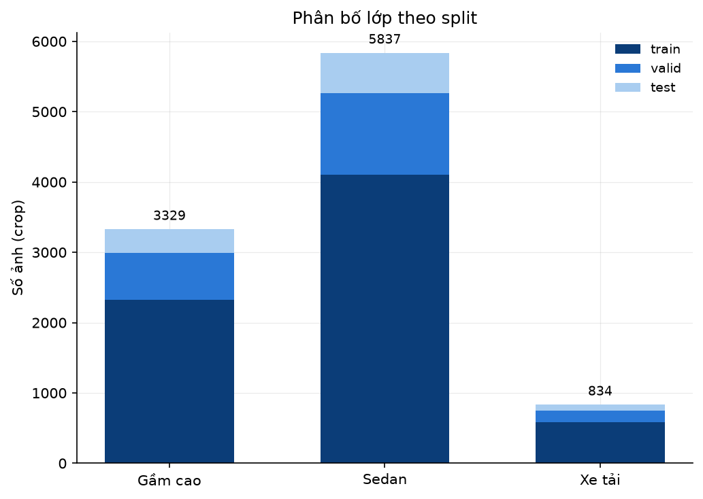
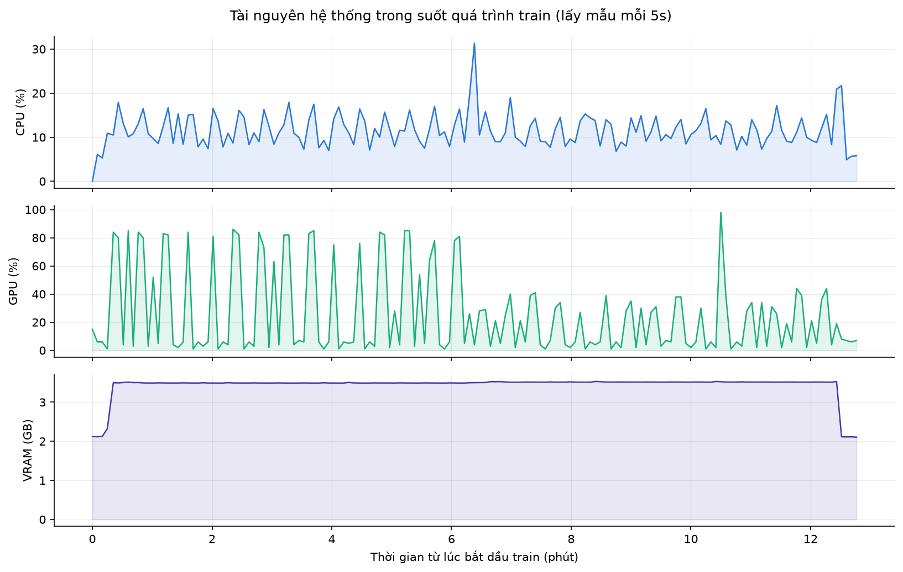
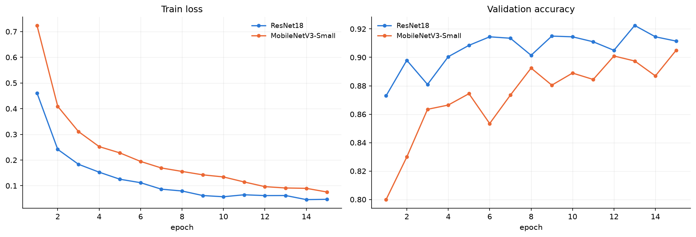
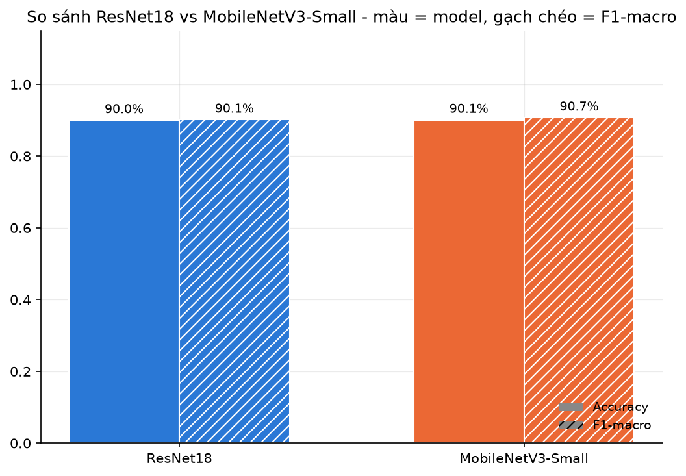
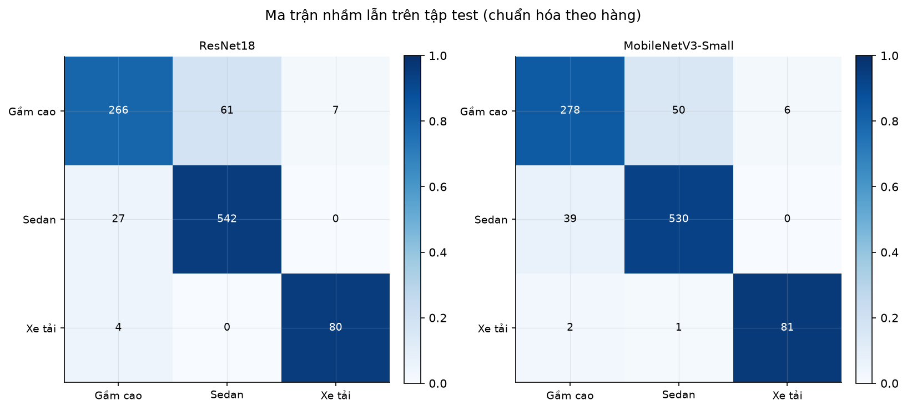

# Chương 5: Phân loại phương tiện

Chương này trình bày module phân loại loại xe (Nhật, Tuần 5). Kiến trúc gồm 2 bước:

1. **Loại thô** (ô tô/xe máy/xe tải/xe buýt): dùng một model YOLO pretrained (COCO), không huấn luyện thêm.
2. **Kiểu dáng xe con** (chỉ chạy khi bước 1 ra "ô tô"): model tự huấn luyện, 3 lớp: `Sedan`, `Gầm cao`, `Xe tải`.

**Lưu ý về phạm vi so với đề cương:** đề cương ghi "huấn luyện đủ 4 lớp (ô tô, xe máy, xe tải, xe buýt), đánh giá sâu 2 lớp chính". Nhóm không huấn luyện riêng model cho 4 lớp này, dùng thẳng model YOLO pretrained, vì có bằng chứng thực nghiệm rõ ràng (mục 5.5) rằng model tự huấn luyện trên dữ liệu công khai hiện có kém hơn hẳn model pretrained khi test trên ảnh thật. Đây là quyết định kỹ thuật có căn cứ nhưng khác chữ "huấn luyện" trong đề cương, cần trao đổi lại với giảng viên hướng dẫn.

## 5.1 Dữ liệu

### Dữ liệu cho bước kiểu dáng xe con

B5 (Vehicle Body Style Dataset, Roboflow, CC BY 4.0, 10.000 ảnh: train 7.014 / valid 1.999 / test 987, 12 kiểu dáng gốc) dùng làm nguồn duy nhất cho bước phân loại kiểu dáng xe con.

**Gộp 12 kiểu dáng gốc còn 3 nhóm thực dụng hơn**, phù hợp nhu cầu vận hành bãi xe (sedan/gầm cao/xe tải), thay vì 12 kiểu dáng chi tiết không có ý nghĩa vận hành rõ ràng:

| Nhóm mới | Kiểu dáng gốc B5 gộp vào |
|---|---|
| `Sedan` | Sedan, Fastback, Hatchback, Wagon, Convertible, Hardtop Convertible, Sports |
| `Gầm cao` | SUV, Crossover, MPV, Minibus |
| `Xe tải` | Pickup Truck |

Ảnh cắt theo bbox gốc (thêm biên 10%), giữ nguyên split train/valid/test của Roboflow. Số ảnh sau khi gộp:

| Lớp | Train | Valid | Test |
|---|---:|---:|---:|
| Sedan | 4.102 | 1.166 | 569 |
| Gầm cao | 2.325 | 670 | 334 |
| Xe tải | 587 | 163 | 84 |

Tổng 10.000 ảnh.

Lớp `Xe tải` ít nhất nhưng vẫn có 587 ảnh train, đủ để huấn luyện ổn định. Xử lý mất cân bằng lớp bằng trọng số trong hàm loss.

Dữ liệu B5 còn hạn chế domain gap: ảnh train là ảnh dealer/showroom, một phần bối cảnh Trung Quốc, không phải ảnh camera giám sát Việt Nam. Bàn kỹ hơn ở mục 5.5.

## 5.2 Kiến trúc mô hình

**Bước 1 (loại thô):** một model YOLO pretrained trên COCO, không huấn luyện thêm, tận dụng 4 lớp có sẵn `car`/`motorcycle`/`bus`/`truck` (id 2/3/5/7). Trong thử nghiệm này nhóm dùng cụ thể YOLOv8n, nhưng thiết kế cho phép thay bằng phiên bản YOLO khác (YOLOv9, YOLO26...) mà không cần đổi logic pipeline. Với 1 ảnh đầu vào, lấy box xe có diện tích lớn nhất, crop kèm biên 10%, đưa sang bước 2 nếu nhãn là `car`.

**Bước 2 (kiểu dáng):** so sánh 2 kiến trúc, fine-tune từ trọng số ImageNet, thay lớp cuối cho 3 lớp:
- **ResNet18**: 11.178.051 tham số.
- **MobileNetV3-Small**: 1.520.931 tham số, nhẹ hơn ResNet18 khoảng 7,3 lần.

Ảnh vào 224×224, chuẩn hóa theo thống kê ImageNet. Augmentation: random-resized-crop (scale 0,8-1,0), lật ngang, xoay ±10°, color jitter.

## 5.3 Huấn luyện

Huấn luyện local trên GPU NVIDIA RTX 4070, không dùng Colab để tránh giới hạn phiên free tier. Cấu hình: Adam, learning rate 1e-4, batch size 32, 15 epoch, `CrossEntropyLoss` có trọng số lớp.

| Model | Thời gian train |
|---|---:|
| ResNet18 | 6,09 phút |
| MobileNetV3-Small | 6,09 phút |

Tổng 12,2 phút cho cả 2 lượt.

Theo dõi tài nguyên thật trong lúc train (lấy mẫu mỗi 5 giây, `src/ml/monitor_resources.py`, 153 mẫu): CPU trung bình 11,5% (đỉnh 31,3%), GPU trung bình 25,6% (đỉnh 98%), VRAM ổn định quanh 3,5GB/12GB. Mô hình nhỏ nên không tận dụng hết GPU.

Cả 2 kiến trúc hội tụ nhanh và ổn định. Bài toán 3 lớp dễ hơn hẳn bài toán 12 lớp đã thử trước đó: accuracy epoch 1 đã trên 0,80, so với khoảng 0,4-0,6 ở bản 12 lớp. Khoảng cách giữa ResNet18 và MobileNetV3-Small cũng thu hẹp đáng kể so với bài toán 12 lớp.

## 5.4 Kết quả

Đánh giá trên tập test (987 ảnh, không dùng khi train hay chọn tham số):

| Model | Accuracy | F1-macro | Params | ONNX | CPU inference |
|---|---:|---:|---:|---:|---:|
| ResNet18 | 0,8997 | 0,9012 | 11.178.051 | 44,70 MB | 8,57 ms/ảnh |
| MobileNetV3-Small | 0,9007 | 0,9069 | 1.520.931 | 6,09 MB | 4,82 ms/ảnh |

*(CPU inference đo trên máy train, không phải Raspberry Pi 5. Số Pi 5 thật để dành Tuần 7-8.)*

So với bài toán 12 lớp đã thử trước đó, accuracy cải thiện rõ rệt (ResNet18 từ 0,768 lên 0,900, MobileNetV3-Small từ 0,701 lên 0,901). Với chỉ 3 lớp, MobileNetV3-Small gần như ngang bằng ResNet18 về accuracy dù nhẹ hơn 7,3 lần, khác hẳn khoảng cách lớn ở bài toán 12 lớp.

Ma trận nhầm lẫn cho thấy `Sedan` và `Xe tải` được phân loại tốt (93,1-96,4% đúng tùy model). Nhầm lẫn tập trung ở `Gầm cao`, là lớp yếu nhất ở cả 2 model (79,6% với ResNet18, 83,2% với MobileNetV3-Small), chủ yếu bị đoán nhầm thành `Sedan` (18,3% và 15,0% số ảnh tương ứng). Điều này hợp lý vì crossover cỡ nhỏ đôi khi có dáng gần sedan, ranh giới giữa 2 nhóm này vốn không tuyệt đối rõ ràng kể cả với người quan sát.

### Kiểm thử trên ảnh thật

Để kiểm chứng thực tế, không chỉ tin vào accuracy trên tập test nội bộ, nhóm chạy pipeline đầy đủ (model YOLO cho loại thô, ResNet18 cho kiểu dáng) trên 8 ảnh thật thu thập ngoài dataset, gồm ảnh camera cổng bãi xe thật và ảnh xe phổ biến ở Việt Nam:

| Ảnh | Thực tế | Loại thô | Kiểu dáng | Đúng? |
|---|---|---|---|---|
| Xe máy tại bãi gửi xe (camera trần) | Xe máy | motorcycle (62,9%) | (không áp dụng) | ✓ |
| Xe máy tại cổng có kiosk vé | Xe máy | motorcycle (70,0%) | (không áp dụng) | ✓ |
| Hyundai Santa Fe (SUV) | SUV | car (78,4%) | Gầm cao (99,8%) | ✓✓ |
| Xe máy tại cổng, có nhân viên | Xe máy | motorcycle (53,7%) | (không áp dụng) | ✓ |
| VinFast (crossover điện), camera cổng chúc xuống | Crossover | car (33,2%) | Gầm cao (69,2%) | ✓✓ |
| Mitsubishi Xpander (crossover/MPV), camera cổng chúc xuống | Crossover/MPV | car (35,6%) | Sedan (53,1%, Gầm cao 36,8%) | Đúng loại thô, sai sát biên ở kiểu dáng |
| Toyota Yaris (sedan), camera cổng chúc xuống | Sedan | không phát hiện được | (không áp dụng) | ✗ |
| Xe tải chở hàng thật (biển 29H) | Xe tải | truck (31,5%) | (không áp dụng) | ✓ |

7/8 đúng ở bước loại thô. Trong 3 ảnh được đưa tiếp sang bước kiểu dáng, 2/3 đúng rõ ràng, 1/3 (Xpander) sai nhưng biên độ sát (53% so với 37%), hợp lý vì Xpander là dáng lai sedan/MPV. Điểm yếu còn lại: ảnh chụp từ camera cổng chúc xuống gắt (3 ảnh cuối) làm độ tin cậy giảm (33-36% so với 60-95% ở ảnh chụp ngang tầm mắt), và 1 trường hợp bị bỏ sót hoàn toàn. Model YOLO pretrained quen ảnh chụp ngang tầm mắt (theo phân phối COCO), chưa quen góc camera cổng bãi xe thật.

## 5.5 Thảo luận

**Accuracy trên tập test nội bộ không đảm bảo hiệu năng thật.** Đây là lý do chính khiến nhóm chọn dùng model YOLO pretrained cho bước loại thô thay vì tự huấn luyện trên dữ liệu công khai quy mô nhỏ hiện có: qua thử nghiệm, model tự huấn luyện đạt accuracy rất cao trên tập test riêng của nó nhưng hiệu năng giảm mạnh khi gặp ảnh thật ngoài phân phối train. Model YOLO pretrained, được huấn luyện trên tập dữ liệu đa dạng và tổng quát hơn nhiều, lại cho kết quả tốt hơn trên ảnh thật dù chưa từng thấy ảnh Việt Nam nào. Bài học rút ra: độ đa dạng và đúng khung hình của dữ liệu train quan trọng hơn việc dataset có đúng ngữ cảnh Việt Nam hay không, nếu ngữ cảnh đó lại hẹp và ảnh chất lượng thấp.

**Về việc dùng model pretrained thay vì huấn luyện riêng theo đề cương:** đây là quyết định có căn cứ thực nghiệm, không phải bỏ qua yêu cầu tùy tiện, nhưng khác chữ "huấn luyện" trong đề cương, cần trao đổi với giảng viên hướng dẫn trước khi coi là chốt cuối cùng. Nếu cần tuân thủ đúng chữ đề cương, hướng khắc phục là fine-tune model YOLO (hoặc 1 classifier riêng) trên một tập dữ liệu nhỏ đúng khung hình camera cổng bãi xe, dạng "vehicle entrance". Hướng này đã xác định được nhưng chưa có dataset phù hợp đã kiểm chứng, để lại cho bước tiếp theo.

**Hạn chế còn lại của bước loại thô:** góc camera cổng bãi xe thật (chúc xuống, gắt) làm giảm độ tin cậy và có thể bỏ sót. Cần dữ liệu đúng góc này để fine-tune nếu muốn cải thiện, thay vì chỉ dùng model pretrained gốc.

**Hạn chế của bước kiểu dáng:** vẫn train hoàn toàn trên B5, ảnh dealer/showroom, một phần bối cảnh Trung Quốc. Số liệu 90% trên tập test B5 đo đúng khả năng phân biệt kiểu dáng trong cùng phong cách ảnh với tập train, chưa chứng minh được trên ảnh camera giám sát Việt Nam thật. Ảnh test thật ở mục 5.4 cho thấy tín hiệu tích cực (2/3 đúng, 1/3 sát biên) nhưng cỡ mẫu quá nhỏ để kết luận chắc chắn.

**Hướng tiếp theo (Tuần 6-8):** tích hợp pipeline vào luồng camera thật (Tuần 6); tìm hoặc thu thập dữ liệu đúng góc camera cổng bãi xe để fine-tune cả 2 bước nếu cần, đặc biệt để giải quyết hạn chế góc chúc xuống; đo lại thời gian inference thật trên Raspberry Pi 5, có thể thêm INT8 quantization, chọn model kiểu dáng triển khai dựa trên số đo thật (Tuần 7-8).

## 5.6 Hướng dẫn tích hợp vào pipeline

Mục này dành cho bước tích hợp hệ thống (Tuần 6), khi module phân loại xe được gọi từ luồng xử lý camera.

### Các file cần dùng

| File | Vai trò |
|---|---|
| `src/ml/weights/yolov8n.pt` | Model YOLO pretrained cho bước loại thô (tự tải về lần chạy đầu, không commit vào git) |
| `src/ml/weights/vehicle-style-resnet18.pt` | Model kiểu dáng, bản ResNet18 (44,8 MB) |
| `src/ml/weights/vehicle-style-mobilenet_v3_small.pt` | Model kiểu dáng, bản MobileNetV3-Small (6,2 MB) |
| `src/ml/weights/vehicle-style-*.onnx` | Bản ONNX tương ứng, dùng khi triển khai bằng ONNX Runtime (Raspberry Pi) |
| `src/ml/training/classifier.py` | Chứa `build_model()` và `build_transforms()`, dùng lại khi load model |
| `src/ml/predict_vehicle.py` | Bản tham chiếu chạy được đầy đủ 2 bước cho 1 ảnh |

### Luồng xử lý

1. Đưa ảnh (hoặc frame video) vào model YOLO, lọc lấy các box thuộc 4 lớp `car`(2) / `motorcycle`(3) / `bus`(5) / `truck`(7) của COCO.
2. Chọn box có diện tích lớn nhất làm phương tiện chính, crop kèm biên 10% mỗi chiều.
3. Nếu nhãn không phải `car`, trả kết quả luôn (xe máy/xe tải/xe buýt không cần phân loại kiểu dáng).
4. Nếu nhãn là `car`, đưa ảnh đã crop qua model kiểu dáng để lấy nhãn cuối (`Sedan` / `Gầm cao` / `Xe tải`).

### Ba điểm dễ sai khi tích hợp

**Thứ tự lớp đầu ra theo bảng chữ cái.** `ImageFolder` của torchvision sắp xếp tên thư mục theo bảng chữ cái khi huấn luyện, nên thứ tự lớp của model là `['GamCao', 'Sedan', 'XeTai']`, không phải thứ tự "Sedan, Gầm cao, Xe tải" thường dùng khi trình bày. Cách an toàn nhất khi viết code tích hợp là đọc trực tiếp danh sách lớp từ checkpoint (`ckpt["class_names"]`) thay vì hard-code, vì thứ tự sẽ đổi nếu sau này huấn luyện thêm lớp mới.

**Tiền xử lý phải khớp đúng lúc huấn luyện:** resize cạnh ngắn về 256, center-crop 224×224, chuẩn hóa theo mean/std của ImageNet. Dùng lại `build_transforms(train=False)` trong `classifier.py` là cách an toàn nhất. Sai bước này sẽ làm độ chính xác giảm mạnh mà vẫn chạy bình thường.

**Độ tin cậy thấp ở góc camera cổng.** Như đã nêu ở mục 5.4, ảnh chụp từ camera chúc xuống làm độ tin cậy bước loại thô giảm còn 33-36%, và có trường hợp không phát hiện được xe nào. Khi tích hợp cần xử lý rõ 2 tình huống: không có box nào (bỏ qua frame, thử frame kế tiếp) và độ tin cậy dưới ngưỡng (chưa chốt kết quả, chờ thêm frame). Không nên đặt ngưỡng lọc cao theo mặc định của thư viện vì sẽ loại nhầm nhiều xe ở góc camera này.

### Chọn model nào

Ở tập test, hai kiến trúc gần như ngang nhau về độ chính xác (0,8997 so với 0,9007), nhưng MobileNetV3-Small nhẹ hơn 7,3 lần và nhanh hơn gần 2 lần trên CPU. Với mục tiêu chạy trên Raspberry Pi 5, MobileNetV3-Small là lựa chọn hợp lý hơn. Quyết định cuối cùng vẫn chờ số đo thật trên Pi 5 ở Tuần 7-8.

## 5.7 Kết luận

Công việc đã hoàn thành trong tuần:

- Khảo sát và chốt nguồn dữ liệu cho bài toán phân loại kiểu dáng xe, gộp 12 kiểu dáng gốc của B5 thành 3 nhóm phù hợp nhu cầu vận hành bãi xe, xử lý được 10.000 ảnh crop chia sẵn train/valid/test.
- Xây dựng pipeline phân loại 2 bước hoàn chỉnh, chạy được từ một ảnh đầu vào bất kỳ cho ra nhãn cuối, gồm bước phát hiện và cắt vùng xe tự động.
- Huấn luyện và so sánh 2 kiến trúc ResNet18 và MobileNetV3-Small trên cùng dữ liệu, cùng cấu hình, đạt accuracy 0,8997 và 0,9007 trên tập test, kèm đầy đủ ma trận nhầm lẫn, đường hội tụ và số liệu tài nguyên thật.
- Xuất model sang ONNX cho cả 2 kiến trúc, sẵn sàng cho bước triển khai trên thiết bị biên.
- Viết notebook tổng hợp kết quả huấn luyện và hướng dẫn tích hợp cho bước tiếp theo.

Hai điểm cần lưu ý khi đánh giá kết quả tuần này. Thứ nhất, bước phân loại loại thô dùng model pretrained nên không có số liệu accuracy/F1 riêng cho 2 lớp ô tô và xe máy như đề cương yêu cầu; phần kiểm thử trên ảnh thật ở mục 5.4 chỉ là thử nghiệm nhanh của nhóm với cỡ mẫu nhỏ, chưa phải đánh giá chính thức. Thứ hai, model kiểu dáng huấn luyện hoàn toàn trên dữ liệu ảnh dealer/showroom nên con số 90% chưa phản ánh được hiệu năng trên ảnh camera giám sát thật. Cả hai điểm này đều cần xử lý ở các tuần tiếp theo, hướng cụ thể đã nêu ở mục 5.5.

---

**Tài liệu tham khảo:**
- He, K. et al. (2016). "Deep Residual Learning for Image Recognition." CVPR. (ResNet)
- Howard, A. et al. (2019). "Searching for MobileNetV3." ICCV.
- Jocher, G. et al. Ultralytics YOLOv8 (2023). Dùng bản pretrained COCO cho bước phân loại loại thô, không huấn luyện thêm.
