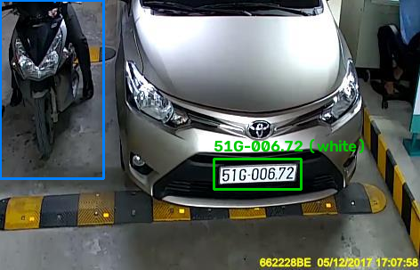
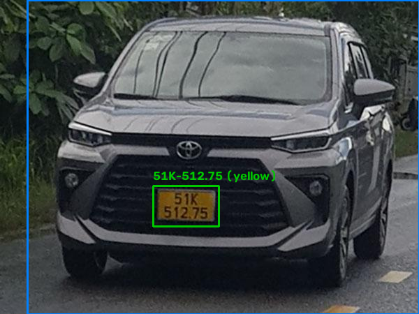
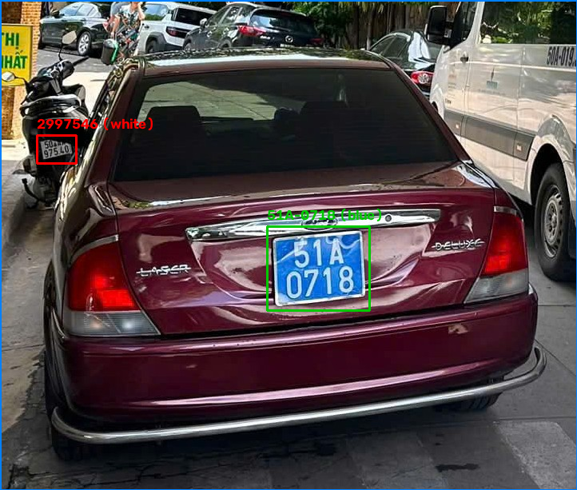
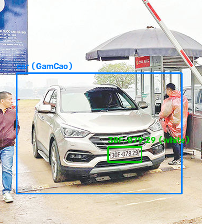
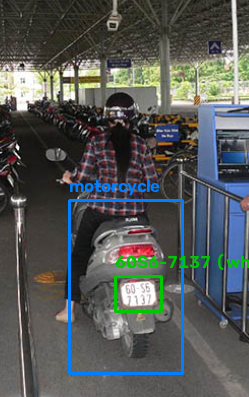

## Tiêu đề đề xuất
Tuần 5 (12/08 – 19/08): Cải tiến phân loại màu biển, công cụ kiểm tra end-to-end, thiết kế MVP backend/dashboard

## Phân công và kết quả

**Nhật: xây dựng end-to-end pipeline test cho 1 luồng hoàn chỉnh, lên kế hoạch MVP gồm UI và API**
- Ghép các module đã có (phát hiện xe, phân loại kiểu dáng, phát hiện biển số, phân loại màu, OCR) thành 1 pipeline chạy được trên ảnh thô, có cả bản notebook và bản dòng lệnh.
- Kiểm thử trên ảnh thật, phát hiện lỗi phân loại màu nền biển số (chi tiết ở phần Đức).
- Lên kế hoạch MVP: luồng nghiệp vụ, 5 màn hình UI, danh sách API endpoint tương ứng, bảo mật, lộ trình triển khai, tách riêng phần trong phạm vi 10 tuần và phần hướng phát triển.

**Đức: tối ưu và sửa module xử lý pipeline màu biển, tham gia đánh giá và bổ sung MVP**
- Sửa module phân loại màu nền biển số (`plate_color_pipeline`): dùng Otsu threshold kết hợp contour detection để loại nhiễu viền crop trước khi đếm màu, thay vì giữ nguyên viền cố định từ detector.
- Kiểm chứng trên 16 biển thật: sửa đúng 1 ca đổi màu sai, không ca nào bị đổi sai thêm, độ tin cậy trung bình tăng 10-25 điểm phần trăm trên phần lớn ảnh.
- Tham gia đánh giá và bổ sung bản thiết kế MVP, trong đó có mục cấu hình bật/tắt từng thành phần AI (đọc biển số, phân loại màu, phân loại xe) và cấu hình camera RTSP.

## Đã hoàn thành

- [x] Cải tiến module phân loại màu nền biển số (`plate_color_pipeline`) (@Đức) → [docs/research/2026-08-21-sua-loi-phan-loai-mau-bien-so.md](../research/2026-08-21-sua-loi-phan-loai-mau-bien-so.md)
  - Phát hiện qua kiểm thử ảnh thật: viền crop cố định (pad=4) từ `PlateDetector` gây nhận nhầm màu biển, không phải do ám màu ánh sáng như giả thuyết ban đầu.
  - Dùng Otsu threshold kết hợp contour detection để tìm đúng vùng nền biển trước khi đếm màu, tái dùng kỹ thuật đã có ở `deskew()`.
  - Kiểm chứng trên 16 biển thật: 1 ca sửa đúng màu (blue thành white), không ca nào bị đổi sai, độ tin cậy trung bình tăng 10-25 điểm phần trăm trên gần hết tập ảnh. 
  - Branch `fix/nhat-plate-color-e2e-test`, đã merge.

- [x] Xây dựng công cụ kiểm tra end-to-end cho toàn bộ pipeline (@Nhật) → [src/ml/e2e_pipeline_test.py](../../src/ml/e2e_pipeline_test.py), [src/ml/notebooks/e2e-pipeline-test.ipynb](../../src/ml/notebooks/e2e-pipeline-test.ipynb)
  - Ghép các module đã có (phát hiện xe, phân loại kiểu dáng, phát hiện biển số, phân loại màu, OCR) chạy tuần tự trên ảnh thô, không qua bước cắt sẵn.
  - Có bản notebook và bản dòng lệnh, cả hai đều xuất ảnh có vẽ bounding box và in kết quả từng biển.
  - Chính công cụ này phát hiện ra lỗi phân loại màu ở mục trên.

- [x] Thiết kế MVP cho phần backend/dashboard quản lý bãi xe (@Nhật) → [docs/design/](../design/)
  - `dashboard-features-draft.md`: tư duy sản phẩm đầy đủ (định vị phân khúc, personas, luồng người dùng kể cả trường hợp lỗi), dùng cho phần hướng phát triển của báo cáo.
  - `dashboard-mvp-1lane.md`: rút gọn phạm vi cho 10 tuần đồ án, cố định 1 lane.
  - `dashboard-mvp-spec.md`: bản chốt để nộp giảng viên hướng dẫn.
  - Branch `docs/nhat-dashboard-mvp-design`, đã merge.

- [x] Phát hiện hạn chế của module OCR với biển seri MĐ (xe máy điện) (@Nhật)
  - Charset hiện tại của CRNN (36 ký tự, không có "Đ") khiến model luôn rớt ký tự này thay vì đọc nhầm.
  - Lỗi này nguy hiểm hơn lỗi OCR thông thường vì vượt qua cả 2 lớp an toàn hiện có (kiểm tra định dạng và ngưỡng độ tin cậy). Kết quả sai nhưng vẫn báo tin cậy cao.
  - Đã xác nhận "MĐ" là seri chính thức theo Thông tư 24/2023 và 79/2024/TT-BCA, không có dataset public nào phủ seri này.

## Kết quả kiểm thử end-to-end

Chạy `src/ml/e2e_pipeline_test.py` trên 15 ảnh thật trong `testimage/`, 16 biển phát hiện được:

| Ảnh | Loại xe | Biển số | Màu | OCR conf |
|---|---|---|---|---:|
| xanh.jpg | car (Sedan) | 51A-0718 (OK) | blue, 76.8% | 0.99 |
| xanh.jpg, biển 2 | | 629297540 (không hợp lệ) | white, 94.3% | 0.93 |
| tai-xe-xanhdocx | car (Sedan) | 50E-101.59 (OK) | yellow, 95.5% | 0.99 |
| t1.png | motorcycle | 60S6-7137 (OK) | white, 95.2% | 0.99 |
| t6.jpg | truck | 29E-063.75 (OK) | yellow, 86.1% | 0.98 |
| m_1742218055.685 | car (Sedan) | 30M-055.91 (OK) | white, 98.5% | 0.98 |
| t5.png | motorcycle | 99F3-2294 (OK) | white, 74.4% | 0.99 |
| xemay293 | không phát hiện | 29C1-209.02 (OK) | white, 80.3% | 0.98 |
| CarLongPlate379 | không phát hiện | 51A-961.41 (OK) | white, 82.9% | 0.98 |
| CarLongPlate306 | motorcycle | 51G-006.72 (OK) | white, 74.3% | 0.98 |
| Hung_0025 | truck | 51D-041.62 (OK) | yellow, 76.5% | 1.00 |
| Dieu_0017 | truck | 51K-364.43 (OK) | white, 79.1% | 0.99 |
| t2.png | motorcycle | 72L9-8014 (OK) | white, 81.1% | 0.98 |
| 068.jpg | không phát hiện | 59B1-311.49 (OK) | white, 81.9% | 0.99 |
| 0043_01757_b | không phát hiện | 65F1-315.32 (OK) | white, 83.7% | 0.99 |
| Dieu_0237 | truck | 51K-512.75 (OK) | yellow, 81.6% | 0.98 |
| t3.png | car (GamCao) | 30F-079.29 (OK) | white, 87.0% | 0.95 |

15/16 biển đọc ra khớp định dạng biển số Việt Nam. Biển không hợp lệ duy nhất (`629297540`) là do phát hiện nhầm 1 vùng không phải biển số thật trong ảnh `xanh.jpg`, không phải lỗi OCR trên biển thật.

Nhánh phát hiện loại xe (YOLOv8n pretrained COCO) còn nhầm lẫn giữa xe con và xe tải với vài xe SUV, do model chưa huấn luyện riêng cho phân biệt này, cần lưu ý khi viết báo cáo chính thức.

Một vài ảnh minh hoạ, có vẽ khung nhận diện xe và biển số:

## Kế hoạch tuần 6

- [ ] Sinh dữ liệu tổng hợp cho ký tự "Đ" (@Nhật)
  - Khoảng 100 ảnh, dùng Pillow với font đã xác nhận có glyph "Đ" (`arialbd.ttf`), tham khảo phong cách từ `topkek_plate_ocr/generated/`.
  - Kết hợp với 3 ảnh thật đã có sẵn (`testimage/MD1.jpeg`, `md.jpeg`, `md2.jpeg`) làm điểm đối chiếu.
  - Mở rộng charset CRNN lên 37 lớp, fine-tune lại model.
- [ ] Đức xem lại bản thiết kế MVP, xác nhận phạm vi và mục hướng phát triển.
- [ ] Bắt đầu triển khai backend theo lộ trình trong `dashboard-mvp-spec.md`: luồng nghiệp vụ cốt lõi trước, nối trực tiếp với pipeline CV hiện có.

## Kết quả đạt được

- Module phân loại màu biển hoạt động chính xác và ổn định hơn trên ảnh thật, có công cụ kiểm chứng tái sử dụng được cho các lần cải tiến sau.
- Có công cụ end-to-end dùng chung cho cả nhóm để kiểm tra pipeline mà không cần chạy từng module riêng lẻ.
- Có bản thiết kế MVP rõ ràng, phân biệt phạm vi làm trong đồ án và phần hướng phát triển, sẵn sàng để bắt đầu code backend.
- Phát hiện sớm 1 hạn chế thật của OCR (biển MĐ) trước khi ảnh hưởng tới demo, có kế hoạch xử lý cụ thể.
