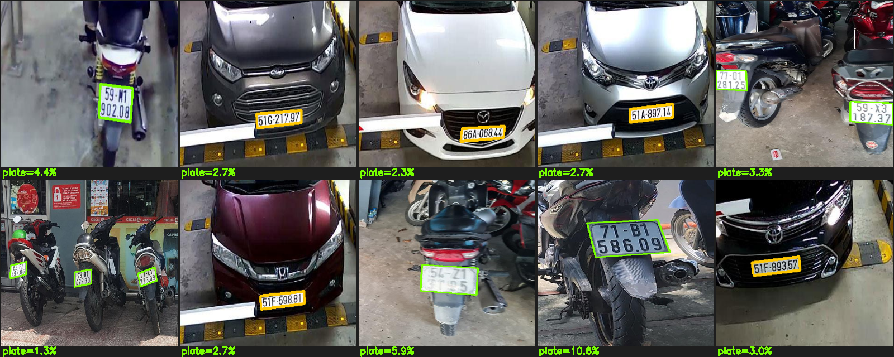
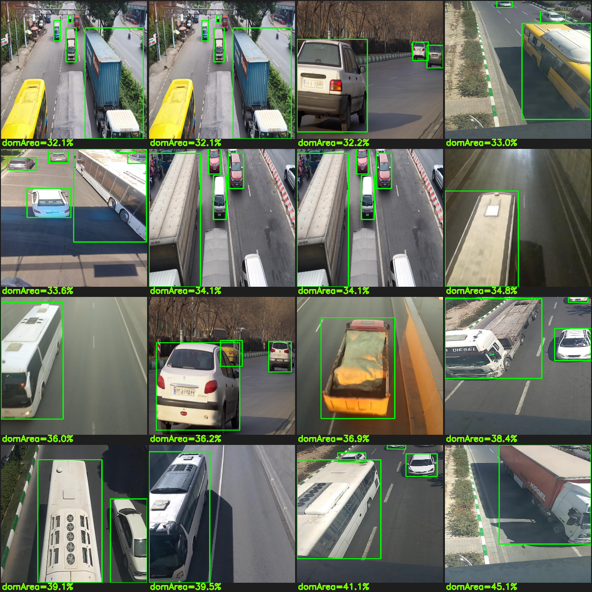
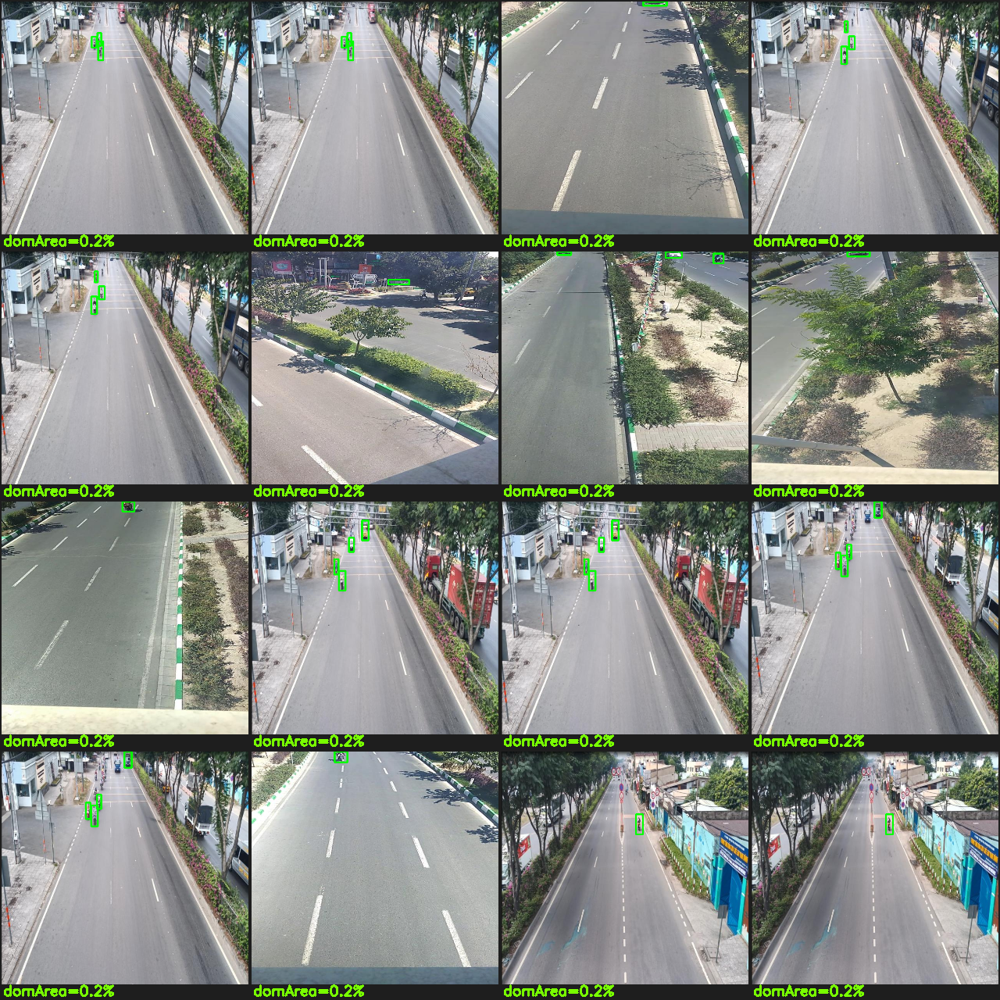
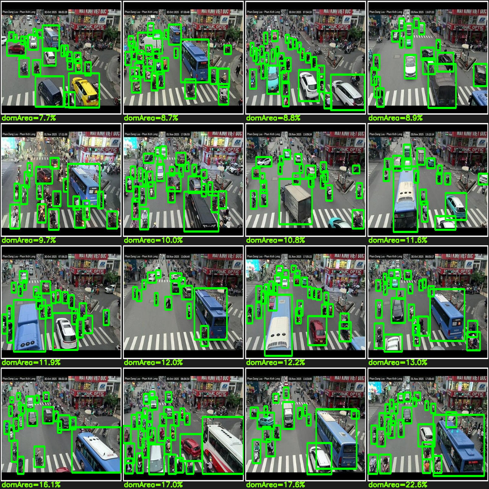

# Báo cáo nghiên cứu: Lọc dataset loại xe theo khung hình camera cổng bãi

**Ngày:** 2026-07-30
**Mode:** 3 (dataset research) — nguyên tắc **không đoán, không giả định**: mọi số liệu lấy từ tải thật + đọc file thật (đếm box, đọc `data.yaml`, đo diện tích/tỉ lệ khung, xem ảnh có vẽ nhãn), có truy vấn Roboflow API để lấy tên lớp gốc.
**Bổ sung/đính chính cho:** [[2026-07-28-dataset-inventory-verified]]
**Câu hỏi nghiên cứu:** Trong các dataset loại xe (Việt Nam) đã thu thập, bộ nào có **xe ở gần, rõ, đơn lẻ** — đúng góc camera cổng ra/vào bãi (đặt góc tốt, không chụp từ xa)?

---

## 0. Kiểm toán giả định — tôi đã đoán những gì, và đã sửa ra sao

Trả lời thẳng câu hỏi "có đoán/giả định gì không": **CÓ 2 chỗ ở bản trước, cả hai nay đã sửa bằng đo đạc thật.**

| # | Giả định/đoán ở bản 07-28 | Sự thật (đo lại) | Cách phát hiện |
|---|---|---|---|
| 1 | duydieu "close-up, biển chiếm 27% khung, **97.8% ảnh gần**" | **SAI — lỗi tính.** `closeness.py` đọc nhầm polygon 4 điểm (`class x1 y1 x2 y2 …`) thành `class cx cy w h`. Số đúng: biển median **3.5%** khung. | Mở file nhãn thật thấy 9 token/dòng (polygon), không phải 5 token bbox → viết lại `closeness2.py` tự nhận polygon |
| 2 | lmphmthanh 4 lớp = **car/moto/truck/bus** | **KHÔNG có nhãn ngữ nghĩa.** `data.yaml` ghi `names: ['0','1','2','3']`. Roboflow API cho thấy project trộn **cả nhãn số lẫn tên** (labeling bẩn) → 4 id số không map tin cậy sang loại xe. | Đọc `data.yaml`; `curl` Roboflow API `car-classification/vietnamese-vehicle` |

Ngoài ra, **1 điểm được xác minh (không còn là giả định):** BSD/BSV của duydieu = biển **dài/vuông**, kiểm bằng tỉ lệ khung nhãn: BSD w/h = **2.53** (dài), BSV w/h = **0.90** (vuông); khớp tiền tố tên file (`carlong_*`→BSD, `greenpack_*`→BSV).

**Bài học đo lường quan trọng:** với dataset mà **box = biển số** (không phải box = xe), diện tích box **không** phản ánh xe gần hay xa (biển luôn là phần nhỏ của xe). Bắt buộc **xem ảnh** để kết luận khung hình.

---

## 1. Phương pháp

- **Đo diện tích chủ thể:** `closeness2.py` — với mỗi ảnh lấy box lớn nhất (chủ thể chính), tính diện tích chuẩn hóa `w×h`. Tự nhận: 5 token = bbox `w,h`; ≥9 token chẵn = polygon (lấy bao lồi 4 điểm). Phân băng: nhỏ xíu <2%, nhỏ 2–8%, vừa 8–25%, LỚN ≥25%. "Gần" = vừa+lớn.
- **Kiểm tên lớp:** đọc `data.yaml`/`dataset.yaml`; truy vấn Roboflow API bằng `ROBOFLOW_API_KEY` (đã có trong `.env`) để lấy tên lớp gốc project.
- **Xem ảnh thật:** vẽ bbox/polygon (`viz_close.py`, `viz_poly.py`), ghi `%` diện tích lên ảnh, dựng lưới 10–16 mẫu theo băng gần/xa.
- **Dữ liệu:** 3 dataset liên quan loại xe/biển đã tải về đĩa (không dùng snippet web).

---

## 2. Kết quả đo (số thật)

| Dataset | Box đại diện | Chỉ số đo đúng | Tên lớp (thật) | Kết luận khung hình |
|---|---|---|---|---|
| **plate_segment_duydieu** | biển (polygon) | biển median **3.5%** khung | `['BSD','BSV']` — biển dài/vuông (verify aspect 2.53 / 0.90) | ✅ **Ảnh cận 1 xe** — hợp cổng bãi (xem §3) |
| **vehicle_lmphmthanh** | xe (bbox) | dominant xe median **5.4%**, gần **32.7%** | `['0','1','2','3']` — **không tên, nhập nhằng** | ❌ Cam đường trên cao, xe xa/xéo |
| **vehicle_cameraview** | xe (pose) | dominant xe median **3.0%**, gần **9.6%** | `{0:car,1:motorcycle,2:truck,3:bus}` | ❌ CCTV ngã tư, xe li ti |

---

## 3. Bằng chứng ảnh (10 mẫu + đối chứng)

### 3.1. duydieu — 10 mẫu ngẫu nhiên: xe GẦN, đơn lẻ, rõ ✅

Mỗi ảnh một xe (ô tô đầu / xe máy đuôi) chụp gần trong sân/bãi. Biển nhỏ (1–16% khung) **vì biển vốn nhỏ**, nhưng **cả xe chiếm gần hết khung** — đúng góc camera cổng. Viền cam = BSD (biển dài, ô tô), viền lục = BSV (biển vuông, xe máy).

*Nhãn `plate=x%` là diện tích biển, không phải diện tích xe — xe gần hơn nhiều so với con số biển.*

### 3.2. Đối chứng — các bộ street-view KHÔNG hợp cổng bãi ❌

**vehicle_lmphmthanh** — 16 ảnh "gần nhất" (dominant 32–45%): vẫn là **camera giao thông trên cao nhìn xuống đường/cao tốc**, xe xéo góc từ xa. (Người dùng xác nhận: street view, không hợp cam cổng.)

**vehicle_lmphmthanh** — ảnh "xa" (dominant 0.2%): đường trống, xe li ti → chứng minh phần lớn xe rất xa.

**vehicle_cameraview** — kể cả "gần nhất": CCTV ngã tư đông đúc, hàng chục xe nhỏ, lệch lớp (bus áp đảo).

---

## 4. Kết luận & khuyến nghị

1. **Trong các bộ gán nhãn loại xe (car/moto/truck/bus)** — `lmphmthanh`, `cameraview` — **không bộ nào** đúng góc cổng bãi; đều street-view/CCTV xa. Thêm nữa `lmphmthanh` **nhãn số `0-3` nhập nhằng**, không dùng làm nhãn loại xe được. Kaggle search (`parking lot vehicle`, `car type classification`, `vehicle rear view`, …) không ra bộ VN cận cảnh cổng bãi.
2. **`duydieu` là bộ hợp góc cổng nhất đang có:** ảnh cận 1 xe đơn lẻ, VN, free, kèm nhãn **BSD/BSV** đã xác minh (biển dài≈ô tô / biển vuông≈xe máy) → dùng làm **proxy loại xe cho 2 lớp chính của bãi** (ô tô, xe máy).
3. **`vehicle_lmphmthanh`** chỉ dùng **pretrain hình dạng xe** (không tin nhãn), rồi fine-tune. **`vehicle_cameraview`** loại hẳn.
4. **Để phân loại đầy đủ (tách thêm truck/bus) và khớp điều kiện triển khai:** **tự thu dữ liệu tại camera cổng bãi** (cũng lấp luôn khoảng trống ảnh ban đêm cho biển 2 hàng). Đây là nguồn chính; các bộ công khai chỉ bổ trợ/pretrain.

## 5. Còn lại

- **Roboflow API đã dùng trực tiếp** (không đoán): xác nhận `vietnamese-vehicle` là bộ mirror của `lmphmthanh` và phát hiện nhãn bẩn. Không cần tải lại (mirror = v3 đã có).
- Bộ biển Roboflow lớn hơn (vd `school-fuhih` ~8.397 ảnh, module detect) có thể tải bằng key nếu cần cho **detect biển** — ngoài phạm vi báo cáo khung-hình-loại-xe này.
- Scripts tái lập: `closeness2.py`, `viz_close.py`, `viz_poly.py` (session scratchpad — chép vào `research/tools/` nếu muốn giữ lâu dài).

**Feeds into:** Chương "Dữ liệu" (W2) — mục dataset loại xe + giới hạn khung hình + lý do tự thu; Phân loại xe (Nhật, W5) — chọn nguồn train (duydieu proxy + tự thu, lmphmthanh pretrain).
